# บทที่ 1 ทำความคุ้นเคยกับ Tool, หลอดไฟ LED, LED 7-Segment(Datasheet), การคำนวณ R อนุกรม

No. |ชื่อเรื่อง|
----- |----- |
1)|[ESP8266](https://github.com/phisic1714/IoT-Learning-Set/blob/main/%E0%B8%9A%E0%B8%97%E0%B8%97%E0%B8%B5%E0%B9%881/%E0%B8%9A%E0%B8%97%E0%B8%97%E0%B8%B5%E0%B9%88_1.md#esp8266-%E0%B8%82%E0%B9%89%E0%B8%AD%E0%B8%A1%E0%B8%B9%E0%B8%A5%E0%B8%97%E0%B8%B1%E0%B9%88%E0%B8%A7%E0%B9%84%E0%B8%9B-%E0%B8%81%E0%B8%B2%E0%B8%A3%E0%B9%83%E0%B8%8A%E0%B9%89%E0%B8%87%E0%B8%B2%E0%B8%99)|
2)|[PlatformIO](https://github.com/phisic1714/IoT-Learning-Set/blob/main/%E0%B8%9A%E0%B8%97%E0%B8%97%E0%B8%B5%E0%B9%881/%E0%B8%9A%E0%B8%97%E0%B8%97%E0%B8%B5%E0%B9%88_1.md#esp8266-%E0%B8%82%E0%B9%89%E0%B8%AD%E0%B8%A1%E0%B8%B9%E0%B8%A5%E0%B8%97%E0%B8%B1%E0%B9%88%E0%B8%A7%E0%B9%84%E0%B8%9B-%E0%B8%81%E0%B8%B2%E0%B8%A3%E0%B9%83%E0%B8%8A%E0%B9%89%E0%B8%87%E0%B8%B2%E0%B8%99)|
3)|[Serial Monitor](https://github.com/phisic1714/IoT-Learning-Set/blob/main/%E0%B8%9A%E0%B8%97%E0%B8%97%E0%B8%B5%E0%B9%881/%E0%B8%9A%E0%B8%97%E0%B8%97%E0%B8%B5%E0%B9%88_1.md#serial-monitor)|
4)|[State Machine](https://github.com/phisic1714/IoT-Learning-Set/blob/main/%E0%B8%9A%E0%B8%97%E0%B8%97%E0%B8%B5%E0%B9%881/%E0%B8%9A%E0%B8%97%E0%B8%97%E0%B8%B5%E0%B9%88_1.md#state-machine)|
5)|[LED ไฟกระพริบ (ภายใน ภายนอก) ด้วย State machine]()|
6)|[ตัวต้านทาน](https://github.com/phisic1714/IoT-Learning-Set/blob/main/%E0%B8%9A%E0%B8%97%E0%B8%97%E0%B8%B5%E0%B9%881/%E0%B8%9A%E0%B8%97%E0%B8%97%E0%B8%B5%E0%B9%88_1.md#%E0%B8%95%E0%B8%B1%E0%B8%A7%E0%B8%95%E0%B9%89%E0%B8%B2%E0%B8%99%E0%B8%97%E0%B8%B2%E0%B8%99)|
7)|[การคำนวณ LED และตัวต้านทาน (R)](https://github.com/phisic1714/IoT-Learning-Set/blob/main/%E0%B8%9A%E0%B8%97%E0%B8%97%E0%B8%B5%E0%B9%881/%E0%B8%9A%E0%B8%97%E0%B8%97%E0%B8%B5%E0%B9%88_1.md#%E0%B8%81%E0%B8%B2%E0%B8%A3%E0%B8%84%E0%B8%B3%E0%B8%99%E0%B8%A7%E0%B8%93-led-%E0%B9%81%E0%B8%A5%E0%B8%B0%E0%B8%95%E0%B8%B1%E0%B8%A7%E0%B8%95%E0%B9%89%E0%B8%B2%E0%B8%99%E0%B8%97%E0%B8%B2%E0%B8%99)|
8)|[LED 7-Segment](https://github.com/phisic1714/IoT-Learning-Set/blob/main/%E0%B8%9A%E0%B8%97%E0%B8%97%E0%B8%B5%E0%B9%881/%E0%B8%9A%E0%B8%97%E0%B8%97%E0%B8%B5%E0%B9%88_1.md#led-7-segment)|

-----
### **ESP8266** ข้อมูลทั่วไป, การใช้งาน
*NodeMCU ESP8266* คือไมโครคอนโทรลเลอร์แบบ SoC (System on Chip) เป็นการรวมการทำงานทั้งหมดที่จำเป็นอยู่ที่ชิปเดียว มี WiFi ในการเชื่อมต่อกับอินเตอร์เน็ตได้ โดยส่วนประกอบหลัก ๆ ที่เราใช้และหน้าที่ขาแต่ละขาบน NodeMCU ESP8266 มีดังนี้
-	ขา **GPIO** (General Purpose Input/Output) คือ ขาทั่วไป สามารถกำหนดสัญญาณข้อมูลอินพุตหรือเอาต์พุตได้
-	ขา **ADC** (Analog-to-Digital Converter) ทำหน้าที่แปลงสัญญาณอะนาล็อก คือ ขา A0 
-	ขา **VIN** เป็นขาที่รับแหล่งจ่ายไฟเข้ามา
-	ขา **3.3V** เป็นแหล่งจ่ายไฟขนาด 3.3 V สำหรับการทำงานของโมดูล
-   ขา **SD Card** ใช้สื่อสารกับการ์ด SD Card
-	ขา **SPI** ใช้เชื่อมต่อกับอุปกรณ์พ่วงในโหมด Master และ Slave โดยใช้สัญญาณนาฬิกา (Synchronous) เป็นตัวกำหนดการรับส่งข้อมูล ได้แก่ D5 (SCK), D6 (MISO), D7 (MOSI) และ D8 (SS/CS) 
-	ขา **I2C** สำหรับรองรับอุปกรณ์ที่ทำงานแบบ I2C ใช้คลื่นความถี่หรือสัญญาณนาฬิกา (Synchronous) ในการทำงาน คือ D1 (SCL) และ D2 (SCK)
-   ขา **PWM** ใช้ส่งสัญญาณ PWM
-   ขา **UART** ใช้เชื่อมต่อกับอุปกรณ์ที่สื่อสารด้วยโปรโตคอล UART คือขา GPIO1 และ GPIIO3
-   ขา **Control** มี RST ขานี้ใช้สำหรับรีเซ็ต NodeMCU 
-   ขา **Reserved** ได้แก่ TX สำหรับการส่งข้อมูลและ RX สำหรับรับข้อมูล
-	ขา **GND** กราวด์


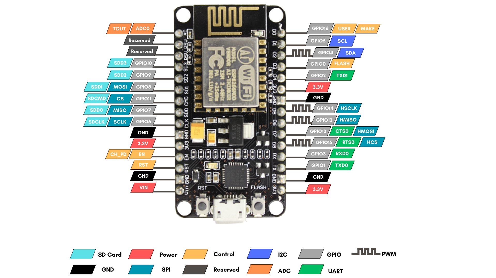


-----
### **PlatformIO** 
*PlatformIO* เป็นซอฟต์แวร์แบบ Open Source ใช้พัฒนาระบบฝังตัวหรือระบบ IoT แบบข้ามแพลตฟอร์มได้ ผ่านบอร์ดไมโครคอนโทรลเลอร์ต่างๆ ที่เกี่ยวข้อง เช่น ESP8266, ESP32 เป็นต้น สำหรับการติดตั้ง ต้องมีโปรแกรม Visual Studio Code (VS Code) ก่อนถึงสามารถติดตั้ง PlatformIO ได้ เนื่องจาก PlatformIO เป็นหนึ่งใน Extension ของ VS Code

-----
### **Serial Monitor**
โดย *Serial Monitor* เป็นส่วนหนึ่งที่ใช้ในการติดต่อสื่อสารของผู้ใช้ระหว่างอุปกรณ์คอมพิวเตอร์กับ NodeMCU ESP8266 ให้แสดงข้อมูลออกผ่านหน้าจอคอมพิวเตอร์ สำหรับการใช้งาน Serial Monitor จะต้องใช้ผ่าน PlatformIO ใน VS Code โดยมีการใช้งาน ดังนี้
#### การใช้งาน Serial Monitor


1)	เปิดหน้า VS Code ไปที่ Extension PlatformIO


2)	คลิกเมนู Device เพื่อตรวจสอบการเชื่อมต่อของอุปกรณ์

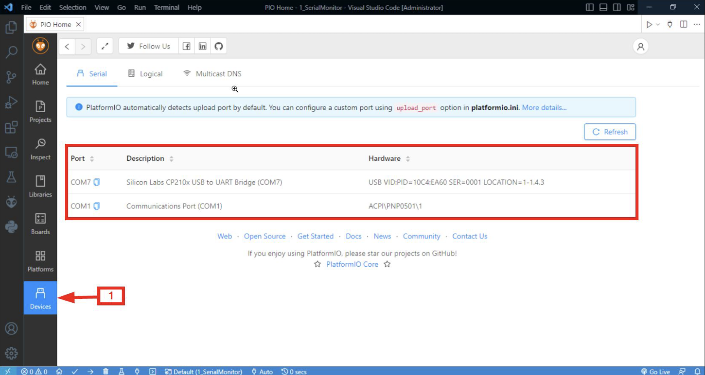

3)	คลิกเมนู Home เลือก New Project


4)	กำหนด Project เบื้องต้น (ในที่นี้ตั้งชื่อ 1_SerialMonitor)

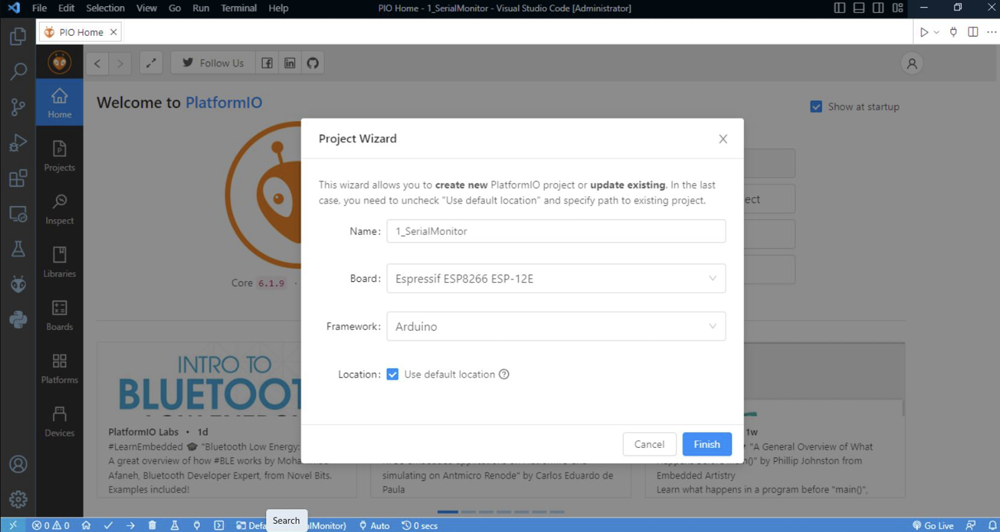

5)	กำหนด baud rate ให้เท่ากันระหว่างไฟล์ platformio.ini กับ main.cpp คือ ไฟล์ platformio.ini
        ให้กำหนดค่า monitor_speed ซึ่งเป็นค่า baud rate ที่เราต้องการ และเช่นเดียวกับในไฟล์ main.cpp มีกำหนดด้วยคำสั่ง Serial.begin(baud rate ที่กำหนด) เพื่อให้สามารถใช้งาน Serial Monitor ได้

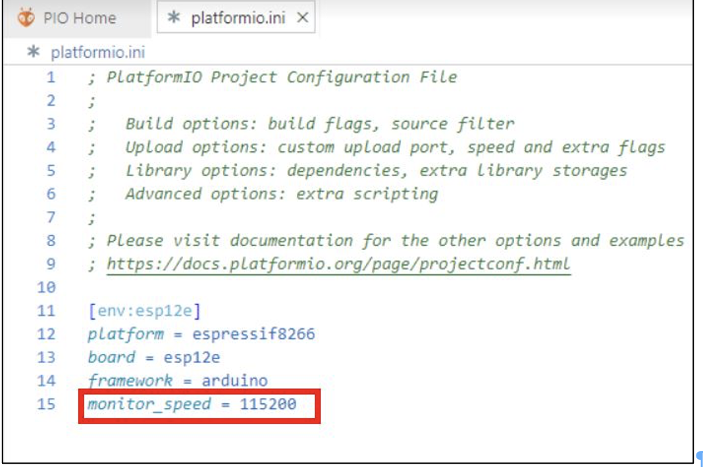

6)	จากนั้นกด Upload

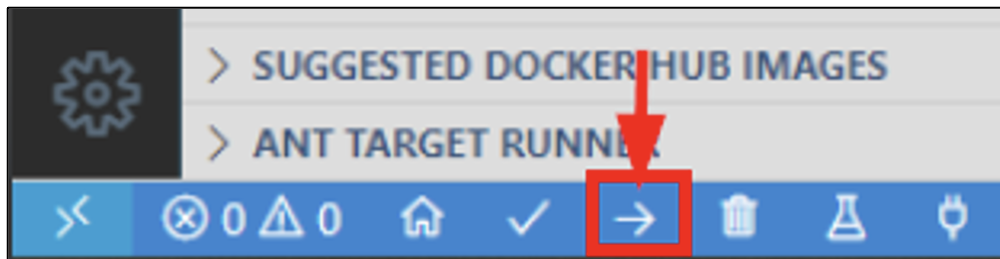

7)	กด Serial Monitor เพื่อดูผลลัพธ์

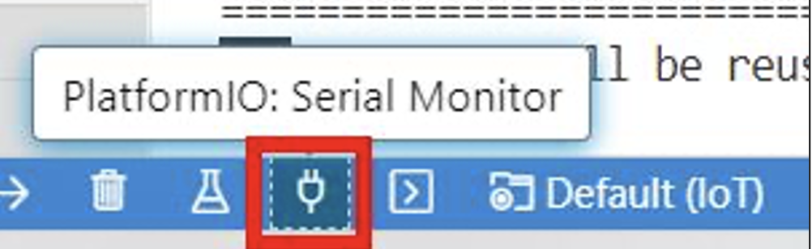
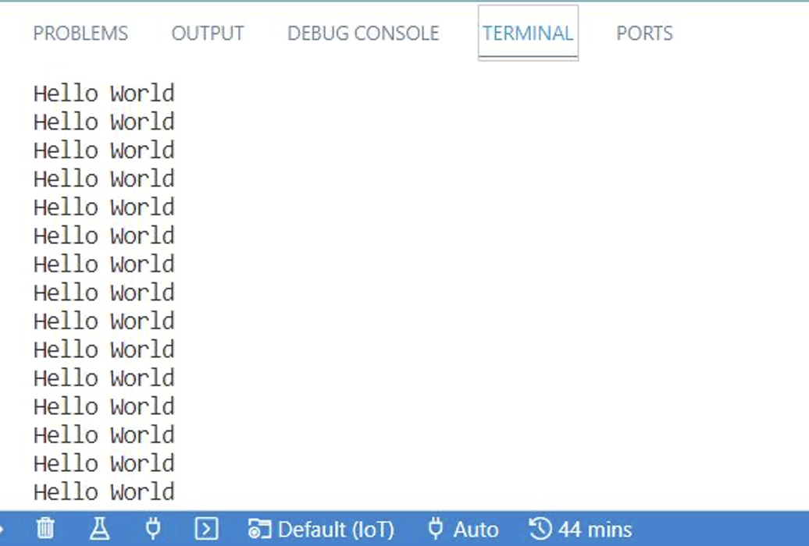
<details><summary>CLICK : <ins>ตัวอย่างที่ 1.1 การแสดงข้อความบน Serial Monitor</ins></summary>
<p>

```ruby
#include <Arduino.h> //เรียกใช้งาน Library Ardunio
void setup() {
    Serial.begin(152000); //การตั้งค่า Baud rate เพื่อเปิดใช้งาน Serial Monitor
}
void loop() {
    Serial.println("Hello World"); //คำสั่งแสดงข้อความ "Hello World" บน Serial Monitor
}
```
<p>
</details>

* **จากโค้ดในตัวอย่าง 1.1** มีการเรียกใช้งาน Library ของ Arduino มีฟังก์ชัน setup() ฟังก์ชันแรกที่ Arduino เริ่มทำงาน โดยกำหนดใช้งาน Serial Monitor และในฟังก์ชัน loop() เป็นการทำงานหลักของ Arduino ให้แสดงข้อความ “Hello World” วนลูปโดยไม่มีที่สิ้นสุด

<details><summary>CLICK : <ins>ตัวอย่างที่ 1.2 การพิมพ์ข้อความบน Serial Monitor</ins></summary>
<p>


```ruby
#include <Arduino.h> //เรียกใช้งาน Library Ardunio
void setup() {
    Serial.begin(152000); //การตั้งค่า Baud rate เพื่อเปิดใช้งาน Serial Monitor
}
void loop() {
    Serial.println("Input : ");
    while(!Serial.available()){} //เมื่อไม่มีการพิมพ์ใดๆ บน Serial Monitor จะทำงานวนใน Loop นี้
    String input = Serial.readString(); //อ่านค่า String จากการพิมพ์ผ่าน Serial Monitor โดยเก็บค่าที่อ่านได้ไว้ในตัวแปร input
    Serial.println(input); 
}
```
<p>
</details>

* **จากโค้ดตัวอย่าง 1.2** ทำงานโดยรอรับการพิมพ์ข้อมูลจาก Serial Monitor โดยใช้ฟังก์ชัน Serial.readString() อ่านค่าที่ได้จากการพิมพ์ โดยจะต้องมีการตรวจสอบการพิมพ์โดยใช้ฟังก์ชัน Serial.available() ในการตรวจสอบ 

-----
### **State Machine**
*State Machine* คือ การกำหนดสถานะการทำงาน มีส่วนช่วยในการออกแบบโปรแกรมคอมพิวเตอร์หรือระบบฮาร์ดแวร์ ให้สามารถควบคุมการทำงานของระบบได้เป็นไปตามลำดับเหตุการณ์ โดยการทำงานของ State Machine จะเริ่มต้นจากการรับข้อมูลอินพุตเข้ามาแล้วจะเปลี่ยนสถานะของการทำงานของตัวระบบตามที่เรากำหนดไว้

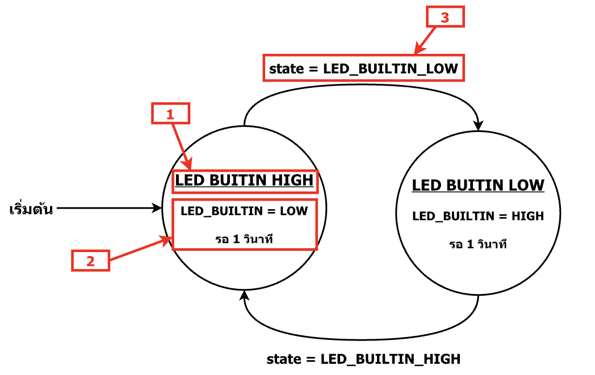

การเขียน *State Machine* จะแทนสถานะต่างๆ ด้วยวงกลม โดยภายในวงกลมจะอธิบายถึงการทำงานของสถานนะนั้นๆ และแต่ละสถานะจะเชื่อมต่อด้วยสัญลักษณ์ลูกศร ที่เป็นเงื่อนไขที่ทำให้เปลี่ยนสถานะ 

#### การออกแบบ State Machine เขียน code
ส่วนประกอบที่สำคัญ ได้แก่

1. **ชื่อสถานะ** กำหนดชื่อทุกสถานะตามการทำงานที่ออกแบบไว้ โดยสถานะเริ่มต้นจะสำคัญที่สุด เนื่องจากเป็นสถานะแรกที่ทำงาน

2. **เหตุการณ์ที่เกิดขึ้น** อธิบายการทำงานของเหตุการณ์ที่เกิดขึ้นในแต่ละสถานะ

3. **เงื่อนไขในการเปลี่ยนสถานะ** คือ การระบุการกระทำ หรือเหตุการณ์ที่ทำให้เปลี่ยนสถานะ เหตุการณ์ทำงาน เช่น กดปุ่มสวิตช์เพื่อเปลี่ยนโหมด เป็นต้น 

#### LED ไฟกระพริบ โดยใช้ State Machine 
สำหรับ LED ที่นำมาทดลองในบทนี้ มี LED Built-in ที่อยู่บนบอร์ด ESP8266 และ LED ภายนอก ที่เป็นการต่อวงจรแยกต่างหากจากบอร์ด มีกำหนดการทำงานให้ไฟกระพริบในรูปแบบ State Machine


<details><summary>CLICK : <ins>ตัวอย่างที่ 1.3 การกำหนดการทำงานไฟกระพริบของ LED Build-IN</ins></summary>
<p>
 

```ruby
#include <Arduino.h> //เรียกใช้งาน Library Ardunio
void setup()
const int LED_LOW=0; //ประกาศตัวแปรสถานะ LED_LOW สถานะที่ 0
const int LED_HIGH=1; //ประกาศตัวแปรสถานะ LED_HIGH สถานะที่ 1
int state; //ประกาศตัวแปรเก็บสถานะ
void setup() {
    state = LED_LOW; //เก็บสถานะเริ่มต้นเป็น LED_LOW ลงไปในตัว state
    pinMode(LED_BUILIN, OUTPUT); //ประกาศขาในการทำงานโดย LED_BUILTIN เป็น OUTPUT
}
void loop() {
    //การทำงานสถานะ LED_LOW
    if(state==LED_LOW) { //ตั้งเงื่อนไขถ้าค่าตัวแปร state เท่ากับค่าตัวแปร LED_LOW
    digitalWrite(LED_BUILTIN, HIGH); //กำหนด LED_BUITIN ดับ
    delay(1000);
    state = LED_HIGH; //เปลี่ยนค่าตัวแปร state เป็น = LED_HIGH
    }
    //การทำงานสถานะ LED_HIGH
    else if(state==LED_HIGH){ //เงื่อนไขถ้าค่าตัวแปร state เท่ากับค่าตัวแปร LED_HIGH
    digitalWrite(LED_BUILTIN, LOW); //กำหนด LED_BUILTIN สว่าง
    delay(1000); //รอเวลา 1000 มิลลิวินาทีหรือ 1 วินาที
    state - LED_LOW; //เปลี่ยนค่าตัวแปร state เป็น = LED_LOW
    }
}
```
<p>
</details>

* **จากโค้ดตัวอย่าง 1.3** ทำงานโดยการสลับสถานะ LED ระหว่าง LED_LOW และ LED_HIGH ทุกๆ 1 วินาที จากนั้นจะทำงานวนลูปไปเรื่อยๆ ของ LED_BUILTIN

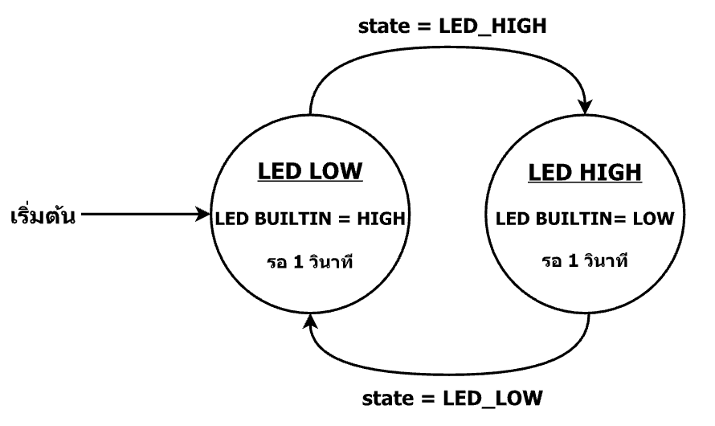

* State Diagram LED BUILTIN กระพริบ State เริ่มต้นคือ LED_LOW สั่งให้ LED_BUILTIN HIGH เพื่อให้ Led Builin ดับ เนื่องจาก Led Builin ทำงานแบบ Active LOW จากนั้นรอ 1 วินาที State จะเปลี่ยนเป็น LED_HIGH สั่งให้ LED_BUILTIN LOW เพื่อให้ Led Builin ติด และรออีก 1 วินาที State จะเปลี่ยนเป็น LED_LOW ทำงานแบบนี้ซ้ำๆ

<details><summary>CLICK : <ins>ตัวอย่างที่ 1.4 การกำหนดการทำงานไฟกระพริบของ LED ภายนอก</ins></summary>
<p>

```ruby
#include <Arduino.h> 
void setup()
const int LED_LOW=0; 
const int LED_HIGH=1; 
int state; 
void setup() {
    state = LED_LOW; 
    pinMode(D0, OUTPUT); //ประกาศขาในการทำงานโดย D0 เป็น OUTPUT
}
void loop() {
    if(state==LED_LOW) { 
    digitalWrite(D0, LOW);
    delay(1000);
    state = LED_HIGH;
    }
    else if(state==LED_HIGH){
    digitalWrite(D0, HIGH); 
    delay(1000); 
    state = LED_LOW;         
    } 
}
```
<p>
</details>

* **จากโค้ดตัวอย่าง 1.4** ทำงานโดยการสลับสถานะ LED ระหว่าง LED_LOW และ LED_HIGH ทุกๆ 1 วินาที จากนั้นทำงานวนลูปไปเรื่อยๆ ของ LED ภายนอก

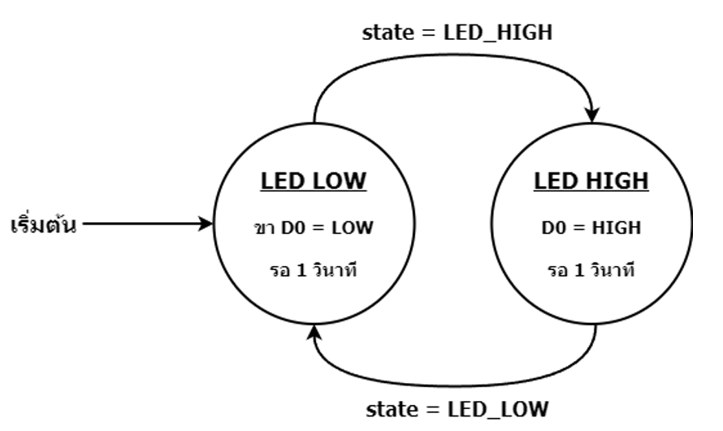

* State Diagram LED ภายนอกไฟกระพริบ กำหนด state เริ่มต้นคือ LED_LOW สั่งให้ ขา D0 LOW เพื่อให้ Led ดับ จากนั้นรอ 1 วินาที State จะเปลี่ยนเป็น LED_HIGH สั่งให้ LED HIGH เพื่อให้ Led ติด และรออีก 1 วินาที State จะเปลี่ยนเป็น LED_LOW ทำงานแบบนี้ซ้ำๆ

-----
### **ตัวต้านทาน**
*ตัวต้านทาน* คือ อุปกรณ์ที่สามารถจำกัดการไหลของกระแสไฟฟ้าและแรงดันไฟฟ้าให้กับวงจรได้ โดยตัวต้านทานที่ใช้ประกอบกับชุดฝึกปฏิบัติจะมี 2 แบบ ได้แก่ ตัวต้านทานคงที่และตัวต้านทานปรับค่าได้
ในการทดลองของบทนี้ใช้ตัวต้านทานคงที่ คือ มีค่าความต้านทานคงที่ สามารถจำกัดการไหลของกระแสไฟฟ้าและแรงดันไฟฟ้าได้ตามแถบสีที่ระบุไว้บนตัวต้านทาน โดยแถบสีบนตัวต้านทานที่มักใช้จะมี 4 แถบ คือ 
-	แถบที่ 1 บอกเลขตำแหน่งที่ 1 
-	แถบที่ 2 บอกเลขตำแหน่งที่ 2 
-	แถบที่ 3 บอกเลขที่คูณกับ 2 แถบแรก
-	แถบที่ 4 เป็นเปอร์เซ็นต์การคลาดเคลื่อน 

แบบ 5 แถบสี คือ

-	แถบที่ 1 บอกเลขตำแหน่งที่ 1 
-	แถบที่ 2 บอกเลขตำแหน่งที่ 2 
-	แถบที่ 3 บอกเลขตำแหน่งที่ 3
-	แถบที่ 4 บอกเลขที่คูณกับ 3 แถบแรก
-	แถบที่ 5 เป็นเปอร์เซ็นต์การคลาดเคลื่อน

ตัวต้านทาน 5 แถบมีความแม่นยำสูงกว่า 4 แถบ เนื่องจากมีแถบสีเพิ่มขึ้น ซึ่งช่วยให้สามารถอ่านค่าตัวต้านทานได้อย่างแม่นยำมากขึ้น 

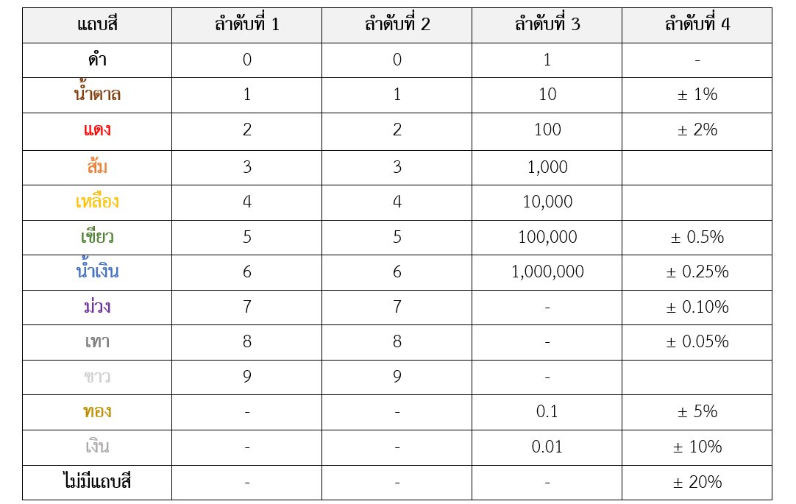

-----
### **การคำนวณ LED และตัวต้านทาน**
การต่อวงจร คือ การต่อให้ไฟฟ้าไหลผ่านวงจรแบบปิด เพื่อให้เกิดเป็นการทำงาน การต่อวงจรจะแตกต่างไปตามขนาด ชนิดและจำนวนของอุปกรณ์ เช่น อุปกรณ์ LED และตัวต้านทาน โดยการต่อวงจรโดยไม่ทำให้ LED เสียหาย ต้องมีการใช้ตัวต้านทานในการลดกระแสต้องมีการคำนวณหาตัวต้านทานให้เหมาะสมกับ LED ที่ใช้ ซึ่ง LED จะมีหลายสีโดยแต่ละสีจะมีการใช้แรงดันและกระแสที่แตกต่างกัน

#### การคำนวณหาตัวต้านทาน โดยมาจากกฎของโอห์ม
R = V/I
V คือ 	แรงดันตกคร่อมที่ LED โดยคิดจาก V = Vcc - Vf 	โดย Vcc คือแรงดันจากแหล่งจ่ายไฟในวงจร 
Vf คือ แรงดันที่ LED ต้องการใช้ 
I คือ 	กระแสที่ ไหลผ่านในวงจร
R คือ	ค่าความต้านทาน
จะได้สูตร 
R = (Vcc - Vf) / If
ตัวอย่าง
Vcc = 5V, Vf = 2.4V, If = 18 mA
R = (5 - 2.4) / 0.018
R = 144.44 Ω 

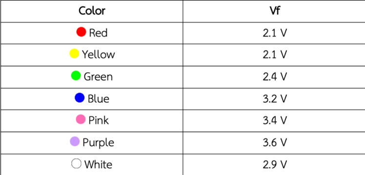

<ins>อ้างอิง</ins> => (https://commandronestore.com/learning/resistor001.php), (http://sittinfo.blogspot.com/2018/05/led.html), (https://www.make-it.ca/3mm-led-specifications/)

### การต่อวงจร 

*การต่อวงจร* มีรูปแบบการต่อวงจรหลากหลาย แต่สำหรับการทดลองในบทนี้ใช้การต่อวงจรแบบอนุกรม เนื่องจากอุปกรณ์ที่ใช้ไม่ได้ต้องการพลังงานเยอะมาก ต่อวงจรผ่านอุปกรณ์ที่เรียงๆ ต่อกันแล้วมาเชื่อมต่อกับกราวน์

-----
### LED 7-Segment 
คือ LED 7 ดวง เป็นอุปกรณ์ใช้สำหรับแสดงผลตัวเลขและบางตัวอักษร โดยใช้แสง LED มีขาจำนวน 9 ขา แต่ละขามีชื่อกำกับอยู่ คือ *ขา A, B, C, D, E, F, G, dot และ common* เมื่อทำการกำหนด HIGH ที่ 7-Segment จะทำให้เกิดผลลัพธ์ตามที่กำหนดได้

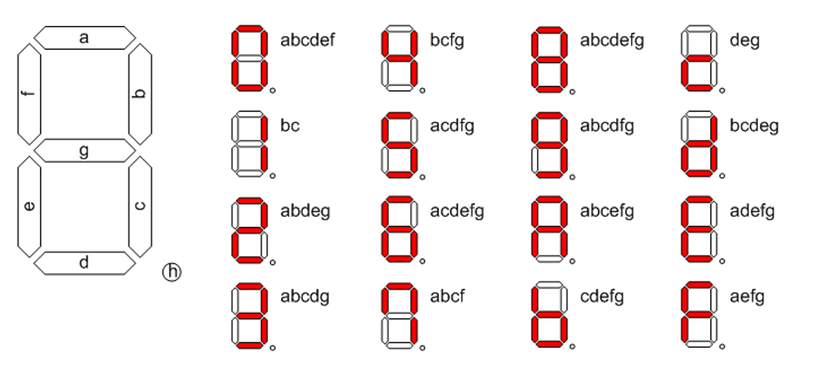


<ins>อ้างอิง</ins> => [การทำงานแต่ละขาของ 7-Segment](https://www.cybertice.com/article/58/การใช้งาน-7-segment-กับ-arduino-ตอนที่-1-7-segment-หลักเดียว)

การทำให้ LED 7-Segment เกิดการทำงานแสดงผลลัพธ์ผ่านหน้าจอจะขึ้นอยู่กับการควบคุมขา common โดยมีหลักในการใช้งานร่วมกับ LED 7-Segment ดังนี้
-	**Common Anode** เป็นการต่อขาแบบ anode ร่วม คือ การทำให้ขา common ของ LED 7-Segment เป็น (0) โดยต่อขา common เข้ากับแหล่งจ่ายไฟและต่อขาที่ต้องการให้เกิดไฟติดของ LED 7-Segment เข้ากับกราวน์ 
-	**Common Cathode** เป็นการต่อขาแบบ cathode ร่วม คือ การทำให้ขา common  ของ LED 7-Segment เป็น (1) โดยต่อขา common เข้ากับกราวน์และต่อขาที่ต้องการให้เกิดไฟติดของ LED 7-Segment เข้ากับแหล่งจ่ายไฟ

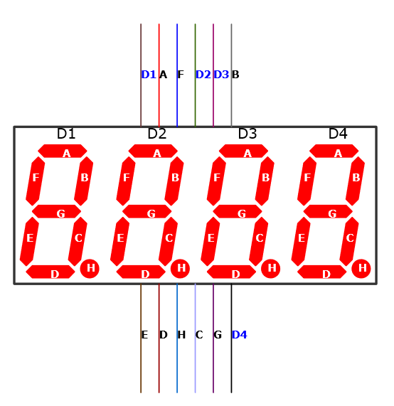

การต่อวงจรทดลองที่ใช้ LED 7-Segment จำเป็นต้องต่อร่วมกับตัวต้านทานเพื่อป้องกันไม่ให้ LED 7-Segment เสียหาย  สำหรับการทดลองในบทนี้ใช้ LED 7-Segment  4 หลัก โดยจะมีขา D1, D2, D3 และ D4 ใช้ในการควบคุมการทำงานแต่ละหลัก D1 ควบคุมหลักพัน D2 ควบคุมหลักร้อย D3 ควบคุมหลักสิบ และ D4 ควบคุมหลักหน่วย

<details><summary>CLICK : <ins>ตัวอย่างที่ 1.5 แสดงเลข "1234" บน LED 7-Segment 4 หลัก</ins></summary>
<p>

```ruby
#include "Arduino.h"
int Digit_pins[] = {D0, D1, D2, D3};               // กำหนด Port สำหรับขา Digit 4 ถึง 1
int Segment_pin[] = {D4, D5, D6, D7, D8, D9, D10}; // กำหนด Port สำหรับขา Segment  A ถึง G
const int SHOW_DIGIT_1 = 1;
const int SHOW_DIGIT_2 = 2;
const int SHOW_DIGIT_3 = 3;
const int SHOW_DIGIT_4 = 4;
int state;
void setup()
{
    state = SHOW_DIGIT_1;
    // กำหนดให้ขาที่ใช้เป็น Output ประกาศทีล่ะ Port จากตัวแปร Digit_pins
    for (int i = 0; i < 4; i++)
    {
        pinMode(Digit_pins[i], OUTPUT);
    }
    // กำหนดให้ขาที่ใช้เป็น Output ประกาศทีล่ะ Port จากตัวแปร Segment_pin
    for (int i = 0; i < 7; i++)
    {
        pinMode(Segment_pin[i], OUTPUT);
    }
}
void loop()
{
                  if (state == SHOW_DIGIT_1)
    {
         // กำหนดให้ขาเปิดใช้ขา Digit 1 ทำงาน และปิดขา Digit 2,3,4
        digitalWrite(Digit_pins[0], HIGH);
        digitalWrite(Digit_pins[1], HIGH);
        digitalWrite(Digit_pins[2], HIGH);
        digitalWrite(Digit_pins[3], LOW);
        // แสดงเลข 4 บน 7 Segment
        digitalWrite(Segment_pin[0], LOW);
        digitalWrite(Segment_pin[1], HIGH);
        digitalWrite(Segment_pin[2], HIGH);
        digitalWrite(Segment_pin[3], LOW);
        digitalWrite(Segment_pin[4], LOW);
        digitalWrite(Segment_pin[5], HIGH);
        digitalWrite(Segment_pin[6], HIGH);
        delay(1);
        state = SHOW_DIGIT_2;
    }
    else if (state == SHOW_DIGIT_2)
    {
        // กำหนดให้ขาเปิดใช้ขา Digit 2 ทำงาน และปิดขา Digit 1,3,4
        digitalWrite(Digit_pins[0], HIGH);
        digitalWrite(Digit_pins[1], HIGH);
        digitalWrite(Digit_pins[2], LOW);
        digitalWrite(Digit_pins[3], HIGH);
        // แสดงเลข 3 บน 7 Segment
        digitalWrite(Segment_pin[0], HIGH);
        digitalWrite(Segment_pin[1], HIGH);
        digitalWrite(Segment_pin[2], HIGH);
        digitalWrite(Segment_pin[3], HIGH);
        digitalWrite(Segment_pin[4], LOW);
        digitalWrite(Segment_pin[5], LOW);
        digitalWrite(Segment_pin[6], HIGH);
        delay(1);
        state = SHOW_DIGIT_3;
    }
    else if (state == SHOW_DIGIT_3)
    {
        // กำหนดให้ขาเปิดใช้ขา Digit 3 ทำงาน และปิดขา Digit 1,2,4
        digitalWrite(Digit_pins[0], HIGH);
        digitalWrite(Digit_pins[1], LOW);
        digitalWrite(Digit_pins[2], HIGH);
        digitalWrite(Digit_pins[3], HIGH);
        // แสดงเลข 2 บน 7 Segment
        digitalWrite(Segment_pin[0], HIGH);
        digitalWrite(Segment_pin[1], HIGH);
        digitalWrite(Segment_pin[2], LOW);
        digitalWrite(Segment_pin[3], HIGH);
        digitalWrite(Segment_pin[4], HIGH);
        digitalWrite(Segment_pin[5], LOW);
        digitalWrite(Segment_pin[6], HIGH);
        delay(1);
        state = SHOW_DIGIT_4;
    }
    else if (state == SHOW_DIGIT_4)
    {
         // กำหนดให้ขาเปิดใช้ขา Digit 4 ทำงาน และปิดขา Digit 1,2,3
        digitalWrite(Digit_pins[0], LOW);
        digitalWrite(Digit_pins[1], HIGH);
        digitalWrite(Digit_pins[2], HIGH);
        digitalWrite(Digit_pins[3], HIGH);
        // แสดงเลข 1 บน 7 Segment
        digitalWrite(Segment_pin[0], LOW);
        digitalWrite(Segment_pin[1], HIGH);
        digitalWrite(Segment_pin[2], HIGH);
        digitalWrite(Segment_pin[3], LOW);
        digitalWrite(Segment_pin[4], LOW);
        digitalWrite(Segment_pin[5], LOW);
        digitalWrite(Segment_pin[6], LOW);
        delay(1);
        state = SHOW_DIGIT_1;
    }
}

```
<p>
</details>

* **จากโค้ดตัวอย่าง 1.5** จะเห็นได้ว่ามีการสั่งให้แต่ล่ะ Segment ทำงานเหมือนกับการสั่ง LED ทำงาน โดยใช้ฟังก์ชั่น digitalWrite() แต่ล่ะ Segment ซึ่งทำให้เกิดมีการใช้คำสั่งซ้ำๆ จึงมีวิธีเพิ่มเติมในการกำหนดการทำงานแต่ล่ะ Segment ให้ดูสั้นลง โดยจะแทนตำแหน่ง Segment ให้อยู่ในเลขฐาน 16 โดยตัวอย่าง

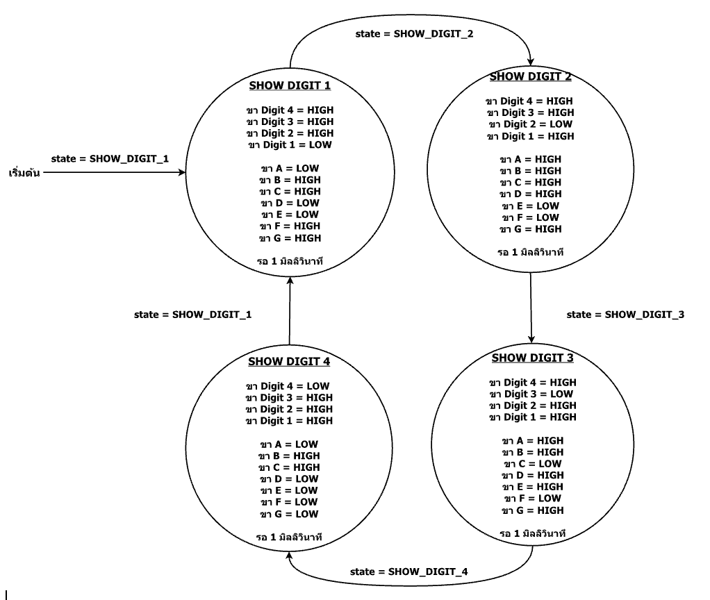

 * State Diagram การแสดงเลข “1234” บน 7-Segment 4 หลัก กำหนด state เริ่มต้นที่ SHOW_DIGIT_1 โดยภายในสถานะนี้สั่งให้ปิดการทำงานทุกขา ยกเว้นขา Digit 1 และควบคุม LED 7-Segment แสดงเป็นเลข 4 บน LCD เป็นเวลา 1 มิลลิวินาที หลังจากนั้นค่าใน state จะเปลี่ยนเป็น SHOW_DIGIT_2 โดยภายในสถานะนี้สั่งให้ปิดการทำงานทุกขา ยกเว้นขา Digit 2 และควบคุม LED 7-Segment แสดงเป็นเลข 3 บน LCD เป็นเวลา 1 มิลลิวินาที หลังจากนั้นค่าใน state จะเปลี่ยนเป็น SHOW_DIGIT_3 โดยภายในสถานะนี้สั่งให้ปิดการทำงานทุกขา ยกเว้นขา Digit 3 และควบคุม LED 7-Segment แสดงเป็นเลข 2 บน LCD เป็นเวลา 1 มิลลิวินาที หลังจากนั้นค่าใน state จะเปลี่ยนเป็น SHOW_DIGIT_4 โดยภายในสถานะนี้สั่งให้ปิดการทำงานทุกขา ยกเว้นขา Digit 4 และควบคุม LED 7-Segment แสดงเป็นเลข 1 บน LCD เป็นเวลา 1 มิลลิวินาที จากนั้นจะทำงานซ้ำตามเงื่อนไขที่เรากำหนดไว้

 * จากในตัวอย่างจะเห็นได้ว่ามีการสั่งให้แต่ล่ะ Segment ทำงานเหมือนกับการสั่ง LED ทำงาน โดยใช้ฟังก์ชั่น digitalWrite() แต่ล่ะ Segment ซึ่งทำให้เกิดมีการใช้คำสั่งซ้ำๆ จึงมีวิธีเพิ่มเติมในการกำหนดการทำงานแต่ล่ะ Segment ให้ดูสั้นลง โดยจะแทนตำแหน่ง Segment ให้อยู่ในเลขฐาน 16 โดยตัวอย่าง ดังรูป

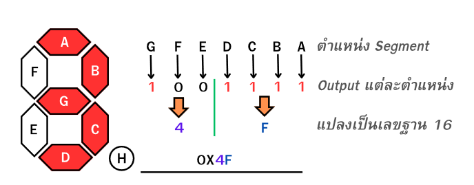

 * จากในรูปจะเริ่มจากกำหนดทำงานของแต่ล่ะ Segment ก็คือเลขฐาน 2 โดย 1 คือไฟสว่าง และ 0 คือไฟดับ จากนั้นแปลงจากเลขฐาน 2 เป็น เลขฐาน 16 จากนั้นให้เติม 0x ไว้หน้าเลขฐาน 16 เพื่อให้ภาษา C รับรู้ว่า นี่คือเลขชนิดฐาน 16 ซึ่งจะมีตัวอย่างแสดงการใช้งาน ดังนี้


<details><summary>CLICK : <ins>ตัวอย่างที่ 1.6 แสดงไฟวิ่งบน LED 7 -Segment ตาม State Diagram</ins></summary>
<p>

```ruby
#include <Arduino.h>
void setup()
int Digit_pins[] = {D0, D1, D2, D3}; 
int Segment_pin[] = {D4, D5, D6, D7, D8, D9, D10};
const int SEGMENT_A = 0;
const int SEGMENT_B = 1;
const int SEGMENT_G_ROUND_1 = 2;
const int SEGMENT_E = 3;
const int SEGMENT_D = 4;
const int SEGMENT_C = 5;
const int SEGMENT_G_ROUND_2 = 6;
const int SEGMENT_F = 7;
unsigned int Seg_val; //เก็บค่าที่จะส่งไปที่ Segment
void Segment_Display(int Seg_val); //ประกาศฟังก์ชันแสดงผล 7 Segmnet
int state;
void setup() 
{
    state = SEGMENT_A; 
    for(int i=0; i<4; i++)
    {
        pinMode(Digit_pins[i], OUTPUT);
    }
    for(int i=0; i<7, i++)
    {
        pinMode(Segment_pin[i], OUTPUT);
    }
}
void loop() 
{
    switch(state)
    {
    case SEGMENT_A: //สถานะ SEGMENT_A
        Seg_val=0x01; //เก็บค่าที่จะสั่งให้ทำงานแต่ลt Segment ลงในตัวแปร Seg_val
        Segment_Display(Seg_val); //ส่งค่า Seg_val ไปที่ฟังก์ชัน Segment_Display
        state=SEGMENT_B; //เปลี่ยนสถานะไป SEGMENT B
        break;
    case SEGMENT_B:
        Seg_val=0x02;
        Segment_Display(Seg_val);
        state=SEGMENT_G_ROUND_1; 
        break;
    case SEGMENT_G_ROUND_1:
        Seg_val=0x40;
        Segment_Display(Seg_val);
        state=SEGMENT_E; 
        break;
    case SEGMENT_E:
        Seg_val=0x10;
        Segment_Display(Seg_val);
        state=SEGMENT_D; 
        break;
    case SEGMENT_D:
        Seg_val=0x08;
        Segment_Display(Seg_val);
        state=SEGMENT_C; 
        break;
    case SEGMENT_C:
        Seg_val=0x04;
        Segment_Display(Seg_val);
        state=SEGMENT_G_ROUND_2; 
        break;
    case SEGMENT_G_ROUND_2:
        Seg_val=0x40;
        Segment_Display(Seg_val);
        state=SEGMENT_F; 
        break;
    case SEGMENT_F:
        Seg_val=0x20;
        Segment_Display(Seg_val);
        state=SEGMENT_A; 
        break;
    }    
}
void Segment_Display(int Seg_val) //ฟังก์ชันแสดงผล 7 Segment
{
    for(int i=0; i<=6; i++)
    {
        digitalWrite(Segment_pin[i], bitRead(Seg_val, i));
    }
    delay(500);
}
```
<p>
</details>

* **จากโค้ดตัวอย่าง 1.6** มีการทำงานคือ แสดงผลบน 7 Segment Display โดยมีการเปลี่ยนการแสดงผลทีละ Segment ในแต่ละสถานะ ทุกๆ 0.5 วินาทีจะเปลี่ยน Segment โดยมีลำดับดังนี้ คือ A, B, G_ROUND1, E, D, C, G_ROUND2, F แล้วกลับมาแสดงที่ A อีกครั้ง

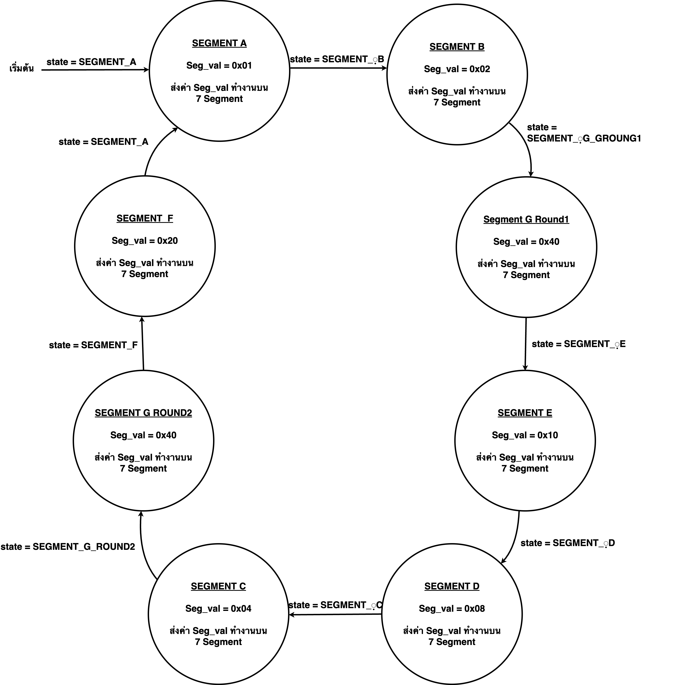
* State Diagram การแสดงไฟวิ่งตามแต่ละ Segment บน LED 7-Segment กำหนด state เริ่มต้นคือ SEGMENT_A สั่งให้ Segment a ติด Segmentที่เหลือดับ จากนั้น0.5 วินาที state จะเปลี่ยนเป็น SEGMENT_B สั่งให้ Segment b ติด Segmentที่เหลือดับ จากนั้น0.5 วินาที state จะเปลี่ยนเป็น SEGMENT_G_ROUND1 สั่งให้ Segment g ติด Segmentที่เหลือดับ จากนั้น0.5 วินาที state จะเปลี่ยนเป็น SEGMENT_E สั่งให้ Segment e ติด Segmentที่เหลือดับจากนั้น0.5 วินาที state จะเปลี่ยนเป็น SEGMENT_D สั่งให้ Segment d ติด Segmentที่เหลือดับจากนั้น0.5 วินาที state จะเปลี่ยนเป็น SEGMENT_D สั่งให้ Segment d ติด Segmentที่เหลือดับจากนั้น0.5 วินาที state จะเปลี่ยนเป็น SEGMENT_D สั่งให้ Segment d ติด Segmentที่เหลือดับจากนั้น0.5 วินาที state จะเปลี่ยนเป็น SEGMENT_C สั่งให้ Segment c ติด Segmentที่เหลือดับจากนั้น0.5 วินาที state จะเปลี่ยนเป็น SEGMENT_G_ROUND2 สั่งให้ Segment g ติด Segmentที่เหลือดับจากนั้น0.5 วินาที state จะเปลี่ยนเป็น SEGMENT_F สั่งให้ Segment f ติด Segmentที่เหลือดับ จากนั้น0.5 วินาที state จะเปลี่ยนเป็น SEGMENT_A สั่งให้ Segment a ติด Segmentที่เหลือดับ ทำงานแบบนี้ซ้ำไปเรื่อยๆ

### คำถามท้ายบทที่ 1
1.	NodeMCU ESP8266 คืออะไร อธิบายพอสังเขป
2.	PlatformIO ทำหน้าที่อะไร
3.	Baud rate มีความสำคัญอย่างไรกับการใช้ Serial Monitor
4.	การกำหนด baud rate สามารถกำหนดได้อย่างไร
5.	ถ้ากำหนด baud rate ไม่ตรงกันจะเกิดผลอย่างไร
6.	State Machine คืออะไร
7.	อธิบายส่วนประกอบในการออกแบบ State Machine มีอะไรบ้าง อธิบายพอสังเขป
8.	ตัวต้านทาน มีหน้าที่ในการทำอะไร
9.	แถบสีสุดท้ายของตัวต้านทานมีหน้าที่บอกอะไร
10.	การควบคุมการทำงาน LED 7-Segment ด้วยขา common ที่เป็น anode และ cathode มีความแตกต่างกันอย่างไร


### ใบงาน 4 ตอน (แบบฝึก)
1. เปิด-ปิด LED ภายนอกโดยผ่าน Serial Monitor
2. LED 2 ดวง ติด-ดับ สลับกัน
3. แสดงปีที่เกิดผ่าน LED 7-Segment
4. แสดงไฟวิ่งแบบย้อนกลับบน LED 7-Segment ตำแหน่ง A > F > G > C > D > E > G > B > A

ผลลัพธ์ใบงาน https://bit.ly/3LyJwMK 
