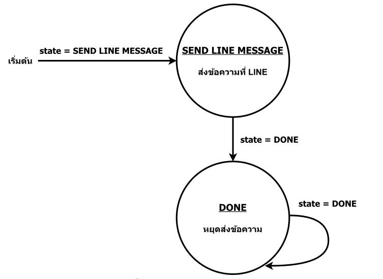

# บทที่ 10 แจ้งเตือน Line

### **Line**
* *Line* คือ **แอปพลิเคชันแชทและโทรศัพท์ ที่มีมากับฟังก์ชันการสื่อสารแบบหลายรูปแบบ** รวมถึงการแชทแบบกลุ่ม การโทรด้วยเสียงและวิดีโอคอล การส่งภาพและวิดีโอ และฟังก์ชันการแชร์สถานที่ รวมถึงฟังก์ชันการสร้างและใช้งานบอท (chatbot) เพื่อช่วยให้สามารถใช้งานได้ง่ายและรวดเร็วมากขึ้น นอกจากนี้ Line ยังมีฟังก์ชันการสนทนาและการส่งข้อความแบบกลุ่มสำหรับธุรกิจและองค์กรที่สามารถใช้งานได้โดยมีความปลอดภัยและสามารถจัดการได้ง่ายขึ้น

* **Line Notify** เป็นบริการของ Line ที่ช่วยให้สามารถส่งข้อความแจ้งเตือนไปยังแชท LINE Notify โดยสามารถสร้าง Token ใน Line Notify แล้วนำ Token นั้นไปใช้งานในโค้ด เพื่อส่งข้อความแจ้งเตือน เช่น แจ้งเตือน ความร้อน / ความชื้น / ฝนตก, แจ้งเตือนการเคลื่อนไหว

#### **ฟังก์ชั่นที่ใช้ในการส่งในแบบต่างๆ**
-   **LINE.notify**(“ข้อความ”)
-   **LINE.notifyPicture**(“ที่อยู่รูปภาพ url”);
-   **LINE.notifySticker**(“PackageID,StickerID”);

**การกำหนดการทำงานร่วมกับ Line มีดังนี้**
1.	ขอ Line Token ที่เว็บไซต์ Line Notify 
2.	สร้าง Token

**<details><summary>CLICK : <ins>ตัวอย่างที่ 10.1 ส่งข้อความผ่าน LINE</ins></summary>**
<p>

```ruby
#include <TridentTD_LineNotify.h>
#include <ESP8266WiFi.h>
#define WIFI_STA_NAME "_________"
#define WIFI_STA_PASS "_________"
#define LINE_TOKEN "_________"
const int SEND_LINE_MESSAGE = 0;
const int DONE = 1;
    int state;
void setup() {
        state = SEND_LINE_MESSAGE;
    Serial.begin(115200);
    WiFi.mode(WIFI_STA);
    Serial.println(WIFI_STA_NAME);
    Serial.println("WIFI Connecting..");
    WiFi.begin(WIFI_STA_NAME, WIFI_STA_PASS);
    for (int i = 0; i < 20; i++)
    {
        Serial.print(".");
        delay(500);
    }
    if (WiFi.status() == WL_CONNECTED)
    {
        Serial.println("Connected to WiFi");
    }
    else
    {
        Serial.println("Fail to Connected WiFi");
    }
    Serial.println(LINE.getVersion());
}
void loop()
{
    switch (state)
    {
    case SEND_LINE_MESSAGE:
        LINE.setToken(LINE_TOKEN);
        LINE.notify("ทดสอบการส่งข้อความ"); // ส่งข้อความไปที่ LINE
        Serial.println("Send LINE Message");
        state = DONE;
        break;
    case DONE:
        // ส่งข้อความเสร็จแล้ว หยุดการทำงาน
        state = DONE;
        break;
    }
}
```
<p>
</details>

* **จากตัวอย่างโค้ด 10.1** เชื่อมต่ออินเทอร์เน็ตในรูปแบบไวฟาย, เพื่อเชื่อมต่อกับ Line chat โดยในโค้ดจะเริ่มทำที่สถานะ SEND_LINE_MESSAGE จะเชื่อมต่อ Token ที่เราได้รับมาก Line เพื่อเชื่มกับ chat จากนั้นจะมีคำสั่ง notify ซึ่งเป็นการระบุข้อความที่จะส่งมาใน chat เมื่อทำเสร็จจะไปสถานะ DONE ซึ่งจะเป็นการหยุดการทำงาน



* State Diagram การส่งข้อความผ่าน LINE state เริ่มต้นที่ SEND_LINE_MESSAGE โดยภายในสถานะนี้จะทำการส่งข้อความ “ทดสอบการส่งข้อความ” ไปที่ไลน์ เมื่อส่งแล้ว state จะถูกเปลี่ยน

### คำถามท้ายบทที่ 10
1.	Line Notify คือ
2.	จำเป็นต้องขอ Token ที่Line Notify หรือไม่ เพราะอะไร
3.	การขอ Token สามารถขอได้ที่เว็ปไหน
4.	LINE.notify() ใช้ส่งอะไร
5.	LINE.notifyPicture() ใช้ส่งอะไร
6.	LINE.notifySticker() ใช้ส่งอะไร
7.	LINE.notifySticker(“A,B”) ตำแหน่ง A และ B ต้องใส่ID อะไรบ้าง
8.	#include <TridentTD_LineNotify.h> ใช้ทำอะไร
9.	คำสั่ง Serial.println(Line.getVersion()); สำหรับประกาศอะไร
10.	หากไม่มี state ชื่อ DONE จะเกิดผลอย่างไร อธิบาย


### ใบงาน 4 ตอน (แบบฝึก)
1)	แจ้งเตือนผ่าน Line ในรูปแบบข้อความและรูปภาพ
2)	แจ้งเตือนผ่าน Line ในรูปแบบสติ๊กเกอร์พร้อมข้อความ
3)	แจ้งเตือนผ่าน Line เมื่ออุณหภูมิมากกว่า 30 องศา และแสดงค่าอุณหภูมิปัจจุบัน
4)	แจ้งเตือนผ่าน Line เมื่ออ่านค่าบัตรตรงกับบัตรที่บันทึกไว้โดยส่งในรูปแบบข้อความ
