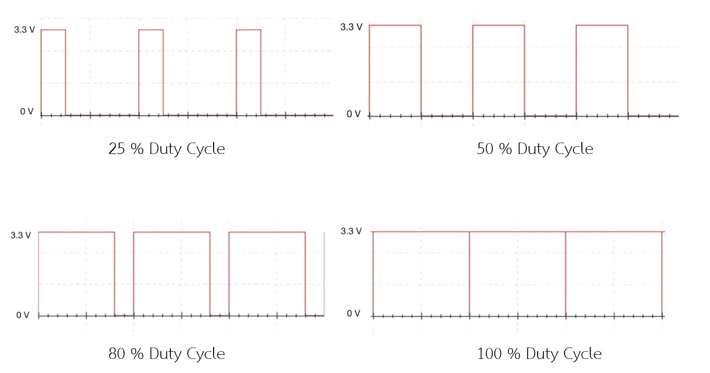
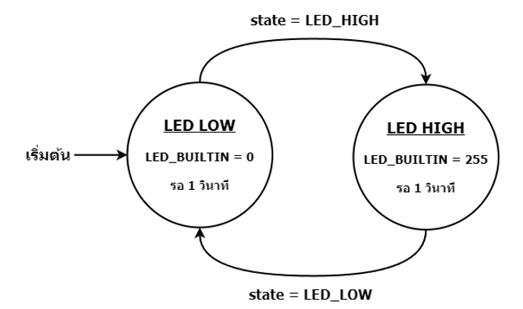
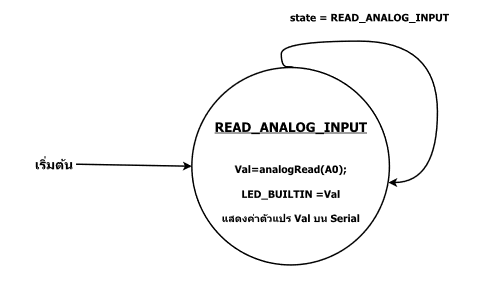
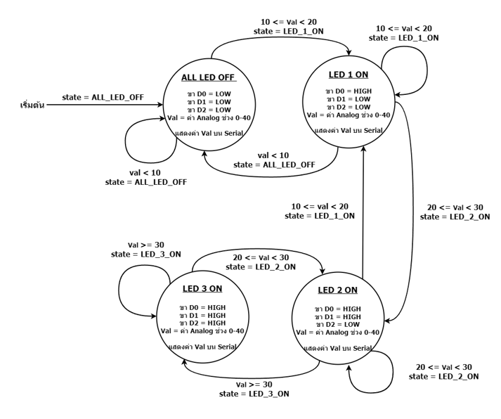
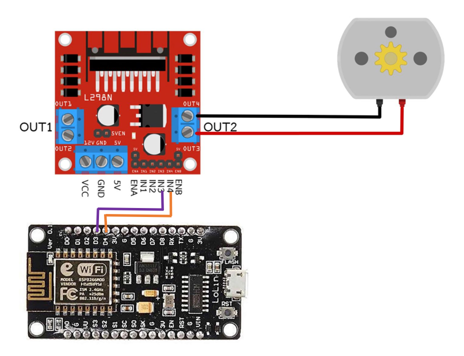
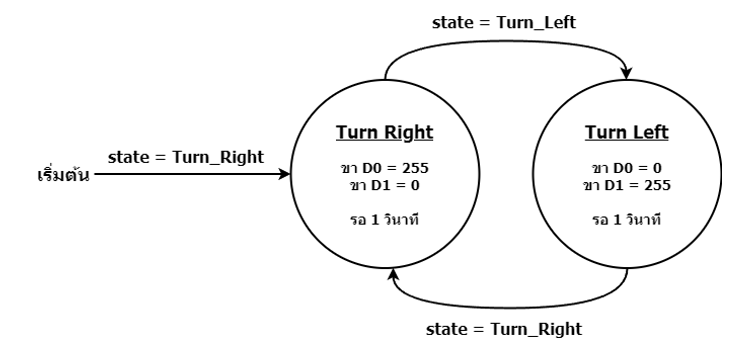

# บทที่ 3 Input Analog: Vr, PWM: DC Motor


No. |ชื่อเรื่อง|
----- |----- |
1)|[PWM](https://github.com/phisic1714/IoT-Learning-Set/blob/Pea/%E0%B8%9A%E0%B8%97%E0%B8%97%E0%B8%B5%E0%B9%883/%E0%B8%9A%E0%B8%97%E0%B8%97%E0%B8%B5%E0%B9%88_3.md#pwm)|
2)|[ตัวต้านทานปรับค่าได้ ](https://github.com/phisic1714/IoT-Learning-Set/blob/Pea/%E0%B8%9A%E0%B8%97%E0%B8%97%E0%B8%B5%E0%B9%883/%E0%B8%9A%E0%B8%97%E0%B8%97%E0%B8%B5%E0%B9%88_3.md#%E0%B8%95%E0%B8%B1%E0%B8%A7%E0%B8%95%E0%B9%89%E0%B8%B2%E0%B8%99%E0%B8%97%E0%B8%B2%E0%B8%99%E0%B8%9B%E0%B8%A3%E0%B8%B1%E0%B8%9A%E0%B8%84%E0%B9%88%E0%B8%B2%E0%B9%84%E0%B8%94%E0%B9%89)|
3)|[Input Analog ](https://github.com/phisic1714/IoT-Learning-Set/blob/Pea/%E0%B8%9A%E0%B8%97%E0%B8%97%E0%B8%B5%E0%B9%883/%E0%B8%9A%E0%B8%97%E0%B8%97%E0%B8%B5%E0%B9%88_3.md#input-analog)|
4)|[DC Motor  ](https://github.com/phisic1714/IoT-Learning-Set/blob/Pea/%E0%B8%9A%E0%B8%97%E0%B8%97%E0%B8%B5%E0%B9%883/%E0%B8%9A%E0%B8%97%E0%B8%97%E0%B8%B5%E0%B9%88_3.md#dc-motor)|


---

### **PWM**  

*PWM* ย่อมาจาก *Pulse Width Modulation* ซึ่งเป็นเทคนิคในการควบคุมสัญญาณ digital เป็นคลื่นสี่เหลี่ยม สร้างออกมาสลับกันระหว่าง HIGH และ LOW  โดยมีความสำคัญที่ความกว้างของช่วงเวลาที่สัญญาณอยู่ในระดับสูง (HIGH) เมื่อเทียบกับระดับต่ำ (LOW ) ซึ่งเรียกว่า *Duty Cycle* 
ใช้ในการควบคุมความเร็วหรือการทำงานของอุปกรณ์ที่ใช้พลังงานไฟฟ้า เช่น การควบคุมความเข้มของแสงในหลอด LED, การควบคุมความเร็วของมอเตอร์ เป็นต้น

**ตัวอย่าง Duty Cycle**

- 25% Duty Cycle คือ คาบเวลาที่เป็น HIGH 25% และคาบเวลาที่เป็น LOW 75% คือส่งกำลัง 25 % 
- 50% Duty Cycle คือ คาบเวลาที่เป็น HIGH 50% และคาบเวลาที่เป็น LOW 50% คือส่งกำลัง 50 %
-	80% Duty Cycle คือ คาบเวลาที่เป็น HIGH 80% และคาบเวลาที่เป็น LOW 20% คือส่งกำลัง 80 %
-	100% Duty Cycle คือ คาบเวลาที่เป็น HIGH 100% และคาบเวลาที่เป็น LOW 0% คือส่งกำลัง 100%



จากตัวอย่าง Duty  Cycle คือ ความกว้างของพัลส์ มีหน่วยเป็นเปอร์เซ็นต์

Duty cycle = 100 x (ความกว้างของพัลส์) / คาบ
100x100/1000 = 10% 

- ความกว้างของพัลล์ มาจากเวลาที่ HIGH 
- คาบ มาจากเวลาทั้งหมดใน1ช่วงคลื่น (ESP8266 มี1000Hz) 
- การกำหนดการใช้งาน PWM จะประกอบด้วย คือ analogWrite(pin, value) ภายใต้วงเล็บanalogWrite ที่เรียงตามลำดับคือ ขา pin, value คือค่า duty cycle 8 bit ที่มีค่าระหว่าง 0-255


**<details><summary>CLICK : <ins>ตัวอย่างที่ 3.1 การกำหนดการทำงานไฟกระพริบของ LED Built-in</ins></summary>**
<p>

```
#include <Arduino.h> 
const int LED_LOW=0; 
const int LED_HIGH=1; 
int state;
void setup() {
  state = LED_LOW;
  pinMode(LED_BUILTIN, OUTPUT); 
}
void loop() {
    if(state==LED_LOW){ 
        analogWrite(LED_BUILTIN, 0);   
        delay(1000);    
        state = LED_HIGH   
    }  
    else if(state==LED_HIGH){    
        analogWrite(LED_BUILTIN, 255);    
        delay(1000);   
        state = LED_LOW;  
    } 
}
```
<p>
</details>

* **จากโค้ดตัวอย่าง 3.1** สลับการสั่งการให้ LED_BUILTIN สว่างและดับ เป็นระยะเวลา 1 วินาที โดยใช้การควบคุมความสว่างไฟด้วยฟังก์ชัน analogWrite() ที่สามารถกำหนดได้ตั้งแต่ 0-255 โดย 0 คือดับ 255 คือ สว่างที่สุดและตัวแปร state สำหรับเก็บสถานะปัจจุบัน สำหรับเปลี่ยนสถานะการทำงานระหว่าง LED_LOW และ LED_HIGH



* State Diagram การกำหนดไฟกระพริบ LED Built-in state เริ่มต้นคือ LED_LOW สั่งให้ LED_BUILTIN มีค่าPWMเท่ากับ 0 รอ1วินาที จากนั้นเปลี่ยน state เป็น LED_HIGH มีค่าPWMเท่ากับ 255 รอ1วินาที จากนั้นเปลี่ยน state เป็น LED_LOW ทำงานแบบนี้ซ้ำไปเรื่อยๆ
### ตัวต้านทานปรับค่าได้ 

โดยตัวต้านทานปรับค่าได้สามารถปรับเปลี่ยนค่าความต้านทานได้ตลอดเวลา

### **Input Analog**  

สัญญาณ analog คือสัญญาณข้อมูลมีความต่อเนื่อง แต่ขนาดของสัญญาณไม่คงที่ และสัญญาณ analog อาจถูกรบกวนได้ง่ายทำให้เกิดข้อผิดพลาดได้ *โดย input analog คือ การรับข้อมูลแบบ analog ที่มีค่าสัญญาณระหว่าง 0-255*


**<details><summary>CLICK : <ins>ตัวอย่างที่ 3.2 การใช้ตัวต้านทานปรับค่าปรับความสว่างของ LED_BUILTIN</ins></summary>**
<p>

```
#include <Arduino.h>
const int READ_ANALOG_INPUT = 0;
int state;
void setup()
{
  state = 0;
  Serial.begin(115200);
  pinMode(LED_BUILTIN, OUTPUT);
}
void loop()
{
  switch (state)
  {
  case READ_ANALOG_INPUT:
¬    int Val = analogRead(A0);
    analogWrite(LED_BUILTIN, Val);
    Serial.print("Val = ");
    Serial.println(Val);
    state = READ_ANALOG_INPUT;
    Serial.println(Val);
  break;
  }
}
```
<p>
</details>

* จากโค้ดตัวอย่าง 3.2 ในการทดลองนี้ คือ ทำให้ Arduino สามารถอ่านค่า Analog ได้ ผ่านขา pin ที่มีชื่อขึ้นต้นด้วย A ทำให้รู้ได้ว่า pin ขานี้สามารถรับข้อมูลแบบ analog ได้ คือ  A0



* State Diagram การกำหนดตัวต้านทานปรับค่าได้ ปรับความสว่างของ LED Built-in state เริ่มต้นคือ READ_ANALOG_INPUT รับค่า analogRead จากขา A0 เพื่อปรับความสว่างของLED_BUILTIN และแสดงค่าตัวแปล Val บน Serial ทำงานซ้ำไปเรื่อยๆ

**<details><summary>CLICK : <ins>ตัวอย่างที่ 3.3 การใช้ตัวต้านทานปรับค่าได้หมุนให้ LED ติดทีละดวง	</ins></summary>**
<p>

```
#include <Arduino.h>
const int ALL_LED_OFF = 0;
const int LED_1_ON = 1;
const int LED_2_ON = 2;
const int LED_3_ON = 3;
int state;
void setup()
{
    state = 0;
    Serial.begin(115200);
    pinMode(D0, OUTPUT);
    pinMode(D1, OUTPUT);
    pinMode(D2, OUTPUT);
}
void loop()
{   
    switch (state)
    {
    case ALL_LED_OFF:
        digitalWrite(D0, LOW);
        digitalWrite(D1, LOW);
        digitalWrite(D2, LOW);
        state = map(analogRead(A0), 0, 1023, 0, 10);
        Serial.print("Val Map = ");
        Serial.println(state);
        break;
    case LED_1_ON:
        digitalWrite(D0, HIGH);
        digitalWrite(D1, LOW);
        digitalWrite(D2, LOW);
        state = map(analogRead(A0), 0, 1023, 0, 10);
        Serial.print("Val Map = ");
        Serial.println(state);
        break;
    case LED_2_ON:
        digitalWrite(D0, HIGH);
        digitalWrite(D1, HIGH);
        digitalWrite(D2, LOW);
        state = map(analogRead(A0), 0, 1023, 0, 10);
        Serial.print("Val Map = ");
        Serial.println(state);
        break;
    case LED_3_ON:
        digitalWrite(D0, HIGH);
        digitalWrite(D1, HIGH);
        digitalWrite(D2, HIGH); 
        state = map(analogRead(A0), 0, 1023, 0, 10);
        Serial.print("Val Map = ");
        Serial.println(state);
        break;   
    }
}
```
<p>
</details>

* **จากโค้ดตัวอย่าง 3.3** เป็นการควบคุมไฟ LED ผ่านขา D1, D2, D3 และทำการอ่านค่าจากการอ่านแบบสัญญาณ Analog(A0) ที่เชื่อมต่อกับบอร์ดแบบ Analog Input แล้วแสดงผ่าน Serial Monitor เช่น อ่านค่า Analog ได้ที่ 21 ผลลัพธ์ที่ได้คือ ไฟ LED ติด 2 ดวง แล้วแสดงค่าบน Serial Monitor ว่า “Val = 21” เป็นต้น



* State Diagram การใช้ตัวต้านทานปรับค่าได้หมุนให้ LED ติดทีละดวง state เริ่มต้นคือ ALL_LED_OFF สั่งให้ D0=LOW ,D1=LOW ,D2=LOW แสดงค่า Val ที่ Serial และเมื่อค่าVal 10<=Val<20 จะเปลี่ยน state เป็น LED_1_ON สั่งให้ D0=HIGH ,D1=LOW ,D2=LOW แสดงค่า Val ที่ Serial และเมื่อค่าVal 20<=Val<30 จะเปลี่ยน state เป็น LED_2_ON สั่งให้ D0=HIGH ,D1=HIGH ,D2=LOW แสดงค่า Val ที่ Serialและเมื่อค่า Val >=30 จะเปลี่ยน state เป็น LED_3_ON สั่งให้ D0=HIGH ,D1=HIGH ,D2=HIGH แสดงค่า Val ที่ Serial และทำงานซ้ำไปเรื่อยๆ

### **DC Motor** 

ดีซีมอเตอร์ เป็นอุปกรณ์มอเตอร์ไฟฟ้ากระแสตรง ทำหน้าที่เปลี่ยนพลังงานไฟฟ้ามาเป็นพลังงานกล ทำให้มอเตอร์หมุน ในการนำมาต่อเป็นวงจรจะใช้ร่วมกับ *โมดูล L298N* เพื่อเป็นตัวควบคุมการจ่ายไฟให้กับ *DC Motor*
การทำให้โมดูล L298N ทำงาน จำเป็นต้องใช้สัญญาณ PWM เข้ามาควบคุมในเรื่องทิศทางและความเร็วในการหมุนของ DC Motor



* ต่อ **IN1, IN2** เข้ากับ ESP8266 เพื่อควบคุมทิศทางและกำลังในการทำงานของมอเตอร์ OUT1
*	ต่อ **IN3, IN4** เข้ากับ ESP8266 เพื่อควบคุมทิศทางและกำลังในการทำงานของมอเตอร์ OUT2
*	**OUT 1, OUT 2** ใช้ในการควบคุม DC Motor 
*	**5V VCC GND** ใช้ในให้พลังงานไฟฟ้าให้กับ L298N และ DC Motor

**<details><summary>CLICK : <ins>ตัวอย่างที่ 3.4 การกำหนดการทำงาน DC Motor หมุนตามเข็มนาฬิกา และ หมุนทวนเข็มนาฬิกา สลับกันครั้งละ 1 วินาที </ins></summary>**
<p>

```
#include <Arduino.h>
const int TURN_RIGHT= 0;
const int TURN_LEFT = 1;
int state;
void setup()
{
    state = TURN_RIGHT;
    pinMode(D0, OUTPUT);
    pinMode(D1, OUTPUT);
}
void loop()
{
    if (state == TURN_RIGHT)
    {
        analogWrite(D0, 255);
        analogWrite(D1, 0);
        delay(1000);
        state = TURN_LEFT;
    }
    else if (state == TURN_LEFT)
    {
        analogWrite(D0, 0);
        analogWrite(D1, 255);
        delay(1000);
        state = TURN_RIGHT;
    }
}
```
<p>
</details>

* **จากตัวอย่างโค้ด 3.4** เป็นการควบคุม DC Motor ที่ต่อกับขา D0, D1, D3 ของบอร์ด โดยการส่งสัญญาณ PWM ด้วย analogWrite เพื่อควบคุมความเร็วของมอเตอร์ โดยทำการสลับการทำงานระหว่างหมุนขวา TURN_RIGHT และหมุนซ้าย TURN_LEFT ทุกๆ 1 วินาที 



* State Diagram กำหนดการทำงาน DC Motor ให้หมุนตามและทวนเข็มนาฬิกาstate เริ่มต้นคือ TURN_RIGHT สั่งให้ขา D0 มีค่าPWM=255, D1 มีค่า PWM=0 หลังจากนั้นรอ 1 วินาที จะเปลี่ยนเป็น state TURN_LEFT สั่งให้ขา D0 มีค่าPWM=0, D1 มีค่า PWM=255 หลังจากนั้นรอ 1 วินาที จะเปลี่ยนเป็น state TURN_RIGHT และทำงานซ้ำไปเรื่อยๆ

### คำถามท้ายบทที่ 3
1.	สัญญาณ analog คืออะไร
2.	ข้อด้อยของสัญญาณ analog
3.	การต่อ Input analog ต้องผ่านขา pin อะไร 
4.	PWM (Pulse Width Modulation) คืออะไร
5.	25% Duty Cycle มีคาบเวลา HIGH และ LOW กี่ %
6.	ถ้า Duty Cycle 75% จะมีกำลังเท่าไหร่
7.	DC Motor คืออะไร
8.	DC Motor หลักการทำงานอย่างไร
9.	โมดูล L298N มีความสำคัญอย่างไรในการต่อวงจร DC Motor
10.	หาก DC Motor หมุนตามเข็มอยู่ ต้องทำอย่างไรถึงจะทำให้ DC Motor หมุนทวนเข็ม

### ใบงาน 4 ตอน (แบบฝึก) 
1.	การใช้ตัวต้านทานปรับค่าได้ ปรับความสว่างของ LED ภายนอก
2.	กดปุ่มที่1เพิ่มความเร็วมอเตอร์ และกดปุ่มที่2 ลดความเร็วมอเตอร์
3.	ใช้ตัวต้านทานปรับค่าได้ คุมทิศทางของมอเตอร์ (ถ้าค่าตัวต้านทาน 0-124 มอเตอร์จะหมุนตามเข็ม และค่า 125-255 มอเตอร์จะหมุนทางซ้าย)
4.	โจทย์ประยุกต์ ใช้ตัวต้านทานปรับค่าได้เพิ่มลดความเร็วมอเตอร์และใช้ปุ่มเพื่อเปลี่ยนการหมุนมอเตอร์เป็นทวนเข็มนาฬิกาและตามเข็มนาฬิกา
 

ผลลัพธ์ใบงาน https://bit.ly/46gal0V 

