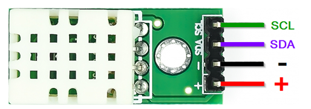

# บทที่ 4 จอ LCD I2C, MCP23008, เซ็นเซอร์วัดอุณหภูมิและความชื้น SHTC3


No. |ชื่อเรื่อง|
----- |----- |
1)|[I2C](https://github.com/phisic1714/IoT-Learning-Set/blob/Pea/%E0%B8%9A%E0%B8%97%E0%B8%97%E0%B8%B5%E0%B9%883/%E0%B8%9A%E0%B8%97%E0%B8%97%E0%B8%B5%E0%B9%88_3.md#pwm)|
2)|[LCD - Liquid Crystal Display ](https://github.com/phisic1714/IoT-Learning-Set/blob/Pea/%E0%B8%9A%E0%B8%97%E0%B8%97%E0%B8%B5%E0%B9%883/%E0%B8%9A%E0%B8%97%E0%B8%97%E0%B8%B5%E0%B9%88_3.md#%E0%B8%95%E0%B8%B1%E0%B8%A7%E0%B8%95%E0%B9%89%E0%B8%B2%E0%B8%99%E0%B8%97%E0%B8%B2%E0%B8%99%E0%B8%9B%E0%B8%A3%E0%B8%B1%E0%B8%9A%E0%B8%84%E0%B9%88%E0%B8%B2%E0%B9%84%E0%B8%94%E0%B9%89)|
3)|[MCP23008](https://github.com/phisic1714/IoT-Learning-Set/blob/Pea/%E0%B8%9A%E0%B8%97%E0%B8%97%E0%B8%B5%E0%B9%883/%E0%B8%9A%E0%B8%97%E0%B8%97%E0%B8%B5%E0%B9%88_3.md#input-analog)|
4)|[SHTC3](https://github.com/phisic1714/IoT-Learning-Set/blob/Pea/%E0%B8%9A%E0%B8%97%E0%B8%97%E0%B8%B5%E0%B9%883/%E0%B8%9A%E0%B8%97%E0%B8%97%E0%B8%B5%E0%B9%88_3.md#dc-motor)|


---

### I2C  
I2C ย่อมาจาก Inter Integrated Circuit เป็นการสื่อสารแบบอนุกรม คืออุปกรณ์หลายตัวที่เชื่อมต่ออยู่ บนสายชุดเดียวกัน เป็นระบบบัสโดยมีอุปกรณ์ที่เป็น Master มีหน้าที่เป็นตัวควบคุมการส่งข้อมูลภายใน ส่วนอุปกรณ์อีกตัวเรียกว่า Slave จะมีเลขประจำตัวไม่ซ้ำกันในสาย ทำหน้าที่เป็นตัวรับข้อมูล เมื่อมีการติดต่อกันจากอุปกรณ์ที่เป็น Master

I2C ประกอบด้วยสายไฟ 4 เส้น คือ
*	สาย SCL ใช้ส่งสัญญาณ กำหนดจังหวะรับส่งข้อมูล
*	สาย SDA ใช้รับส่งข้อมูล
*	สาย VCC ไฟเลี้ยง
*	สาย GND กราวด์

### LCD - Liquid Crystal Display
LCD ย่อมาจาก Liquid Crystal Display เป็นหน้าจอที่ทำมาจากผลึกคริสตัลเหลว หลักการทำงาน คือ เมื่อมีการปล่อยกระแสไฟฟ้าไปกระตุ้นที่ผนึก ผนึกจะโปร่งแสง ทำให้ด้านหลังจอจะมีส่วนที่ไฟสว่าง เรียกว่า Backlight 
การต่อจอ LCD กับไมโครคอนโทรลเลอร์ โดยปกติจะใช้สายไฟฟ้าจำนวนมาก เพื่อลดความซับซ้อนในการต่อจึงเลือกต่อจอ LCD ให้สื่อสารในรูปแบบ I2C ดังนี้
1.	VCC – 3.3 หรือ 5V
2.	GND – GND
3.	SCL – ใช้ส่งสัญญาณ กำหนดจังหวะรับส่งข้อมูล
4.	SDA – ใช้รับส่งข้อมูล


Library ที่ต้องติดตั้ง
-	LiquidCrystal_I2C


<details><summary>CLICK : <ins>ตัวอย่างที่ 4.1 กำหนดการทำงานของ LCD แสดง “Hello World”	</ins></summary>
<p>

```rube

#include "Arduino.h"
#include "Wire.h"                   // เรียกใช้งาน Library Wire
#include "LiquidCrystal_I2C.h"      // เรียกใช้งาน Library LiquidCrystal_I2C
LiquidCrystal_I2C lcd(0x27, 16, 2); // ประกาศ Address กำหนดขนาดของหน้าจอ
const int DISPLAY_HELLO_WORLD = 0;
int state;
void setup()
{
  state = DISPLAY_HELLO_WORLD;
  lcd.init();      // เรียกใช้งาน lcd
  lcd.backlight(); // เปิดใช้งาน Backlight
}
void loop()
{
  switch (state)
  {
  case DISPLAY_HELLO_WORLD:
    lcd.setCursor(0, 0);      // กำหนดตำแหน่งตำแหน่งที่ 0 แถวที่ 0
    lcd.print("Hello"); // กำหนดข้อความที่จะแสดง
    lcd.setCursor(0, 1);      // กำหนดตำแหน่งตำแหน่งที่ 0 แถวที่ 1
    lcd.print("World"); // กำหนดข้อความที่จะแสดง
    break;
  }
}

```

<p>
</details>

* การควบคุม LCD แบบ I2C ที่เชื่อมต่อกับขา SDA(D2) และ SCL(D1) ของบอร์ด โดยใช้ Library LiquidCrystal_I2C เพื่อควบคุมการแสดงผลบน LCD มีขนาด 16x2 มีการกำหนดสถานะปัจจุบัน คือ  DISPLAY_HELLO_WORLD โดยจะแสดงข้อความ “Hello” ที่ตำแหน่ง (0,0) และ “World” ที่ตำแหน่ง (0,1) บน LCD ทุกครั้งที่วนลูป


* State Diagram การทำงาน LCD I2C แสดง “Hello World” กำหนด state เริ่มต้นที่ DISPLAY_HELLO_WORLD โดยภายในสถานะนี้สั่งให้แสดงข้อความ “Hello World” ผ่าน Serial Monitor


### MCP23008

MCP23008
	เป็น IC ขยายอินพุตและเอาต์พุตดิจิทัลผ่านบัส I2C โดยใน 1 ตัวสามารถขยายบัส I2C ได้ถึง 8 ขา เพราะภายในจะมีการตั้ง Address ของขา 3 bit ทำให้สามารถต่อเพิ่มขาของไมโครคอนโทรลเลอร์ได้อีก 8 ขา


การกำหนดการทำงานอุปกรณ์ MCP23008 มีขั้นตอนต่อไปนี้
1.	ติดตั้ง Library ของ MCP23008
2.	กำหนดค่าเริ่มต้นเรียกใช้ MCP23008

Library ที่ต้องติดตั้ง
-	Adafruit_MCP23X08

<details><summary>CLICK : <ins>ตัวอย่างที่ 4.2 วงจร LED ไฟกระพริบโดยใช้ GPIO ของ MCP23008	
</ins></summary>
<p>

``` ruby
#include <Arduino.h>
#include <Adafruit_MCP23X08.h> // ประกาศใช้งานไลบารี่ Adafruit_MCP23X08
Adafruit_MCP23X08 mcp; // ประกาศตัวแปร mcp ให้เป็นตัวแปรของคลาส Adafruit_MCP23X08
const int LED_LOW = 0;
const int LED_HIGH = 1;
int state;
void setup()
{
    state = LED_LOW;
    mcp.begin_I2C(); // กำหนดใช้งานโปรโตคอล I2C
    mcp.pinMode(0, OUTPUT); // กำหนดขา 0 ให้เป็น OUTPUT
}
void loop()
{
    switch (state)
    {
    case LED_LOW:
        mcp.digitalWrite(0, LOW);
        delay(1000);
        state = LED_HIGH;
        break;
    case LED_HIGH:
        mcp.digitalWrite(0, HIGH);
        delay(1000);
        state = LED_LOW;
        break;
    }
}

```
<p>
</details>

* การควบคุม MCP23008 ผ่านโปรโตคอล I2C ให้ LED ไฟกระพริบและมีการกำหนดสถานะปัจจุบันไว้ที่ LED_LOW ไฟดับและรอเวลา 1 วินาที จากนั้นจะเปลี่ยนสถานะเป็น LED_HIGH ไฟสว่างและรอ 1 วินาที จากนั้นจะเปลี่ยนสถานะไปเป็น LED_LOW จะทำงานวนลูปแบบนี้ไปเรื่อยๆ 


* State Diagram การทำงาน LED โดยใช้ GPIO ของ MCP23008 กำหนดค่าเริ่มต้น state ที่ LED_LOW สั่งให้ขา 0 เป็น LOW แล้วรอเวลา 1 วินาที หลังจากนั้นค่าใน state จะเปลี่ยนเป็น LED_HIGH สั่งขา 0 เป็น HIGH แล้วรอเวลา 1 วินาที หลังจากนั้นค่าใน state จะเปลี่ยนเป็น LED_LOW จากนั้นจะทำงานแบบนี้ซ้ำตามเงื่อนไขที่เราตั้งไว้

### SHTC3
SHTC3 คือ เซ็นเซอร์วัดอุณหภูมิและความชื้น การสื่อสารเป็นแบบ I2C รองรับแรงดัน 5 โวลต์  ใช้ตรวจจับความเปลี่ยนแปลงที่เปลี่ยนกระแสไฟฟ้า หรืออุณหภูมิในอากาศ 
การต่อ SHTC3 กับไมโครคอนโทรลเลอร์ มีรูปแบบดังนี้
1.	VCC – 3.3 - 5V
2.	GND – กราวด์
3.	SCL – ใช้ส่งสัญญาณ กำหนดจังหวะรับส่งข้อมูล
4.	SDA – ใช้รับส่งข้อมูล




การกำหนดการทำงานอุปกรณ์ SHTC3 มีขั้นตอนต่อไปนี้
1.	ติดตั้ง Library ของ SHTC3
2.	กำหนดค่าเริ่มต้นเรียกใช้ SHTC3

<details><summary>CLICK : <ins>ตัวอย่างที่ 4.3 กำหนดการทำงานของ SHTC3 แสดงค่าอุณหภูมิและความชื้น ผ่าน LCD และเมื่ออุณหภูมิสูงเกิน 30 องศาเซลเซียส ให้ LED สว่าง
</ins></summary>
<p>


``` ruby
#include "Arduino.h"
#include "SHTC3.h" //เรียกใช้ Library SHTC3.h
#include <Wire.h>
#include <LiquidCrystal_I2C.h>
LiquidCrystal_I2C lcd(0x27, 16, 2);
SHTC3 shtc3(Wire); // เรียกใช้ Wire
const int NORMAL_TEMPERATURE = 0;
const int HIGH_TEMPERATURE = 1;
float temp, humid; // ประกาศตัวแปรเก็บค่าอุณหภูมิและความชื้น
int state;
void lcd_display(); // ประกาศฟังก์ชันแสดงผลบน LCD
void setup()
{
  state = NORMAL_TEMPERATURE;
  Serial.begin(115200);
  Wire.begin(); // เริ่มต้นการใช้การสื่อสารแบบ I2C
  lcd.init();   // initialize the lcd
  lcd.backlight();
  pinMode(D3, OUTPUT);
}
void loop()
{
  switch (state)
  {
  case NORMAL_TEMPERATURE:
    lcd_display(); // เรียกใช้ฟังก์ชันแสดงผลบน LCD
    digitalWrite(D3, LOW);
    if (temp > 30)
    {
      state = HIGH_TEMPERATURE;
    }
    break;
  case HIGH_TEMPERATURE:
    lcd_display();
    digitalWrite(D3, HIGH);
    if (temp < 30)
    {
      state = NORMAL_TEMPERATURE;
    }
    break;
  }
}
void lcd_display() // ฟังก์ชันแสดงผลบน LCD
{
  shtc3.begin(true);            // เริ่มต้นการใช้งาน SHTC3
  shtc3.sample();               // อ่านค่าอุณหภูมิและความชื้น
  temp = shtc3.readTempC();     // อ่านค่าอุณหภูมิ
  humid = shtc3.readHumidity(); // อ่านค่าความชื้น
  lcd.clear();                  // ล้างข้อมูลที่แสดงบน LCD
  lcd.setCursor(0, 0);
  lcd.print(temp); // แสดงค่าอุณหภูมิ
  lcd.print(" C: Temp");
  lcd.setCursor(0, 1);
  lcd.print(humid); // แสดงค่าความชื้น
  lcd.print(" %: Humid");
  delay(1000);
}
``` 
<p>
</details>

* การควบคุมเซนเซอร์ SHTC3 ที่วัดอุณหภูมิและความชื้นผ่านโปรโตคอล I2C มีการกำหนดสถานะ HIGH_TEMPERATURE ทำงานเมื่อค่าอุณหภูมิสูงเกิน 30 องศาเซลเซียส และจะสั่งให้ LED สว่าง และสถานะ NORMAL_TEMPERATURE ทำงานเมื่อค่าอุณภูมิต่ำกว่า 30 องศาเซลเซียส และจะสั่งให้ LED ดับ ทุกสถานะจะแสดงค่าอุณหภูมิและความชื้นผ่าน LCD 


* State Diagram SHTC3 แสดงค่าอุณหภูมิและความชื้นผ่าน LCD หากตรงตามเงื่อนไข LED สว่าง กำหนด state เริ่มต้นที่ NORMAL_TEMPERATURE โดยภายในสถานะนี้สั่งให้ขา D3 เป็น LOW เมื่อ temp มีค่าน้อยกว่า 30 และแสดงค่าอุณหภูมิและค่าความชื้นผ่าน Serial Monitor เป็นเวลา 1 วินาที จากนั้นค่าใน state จะเปลี่ยนเป็น HIGH_TEMPERATURE โดยภายในสถานะนี้สั่งให้ขา D3 เป็น HIGH เมื่อ temp มีค่ามากกว่า 30 และแสดงค่าอุณหภูมิความชื้นผ่าน Serial Monitor เป็นเวลา 1 วินาที จากนั้นทำงานซ้ำตามเงื่อนไขที่เรากำหนด