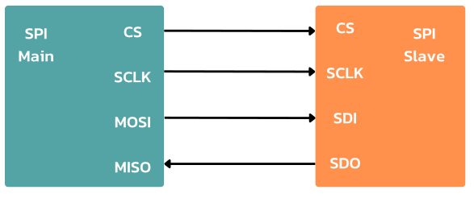

## บทที่ 5 SPI RFID, SD Card, Keycard 

No. |ชื่อเรื่อง|
----- |----- |
1)|[SPI](https://github.com/phisic1714/IoT-Learning-Set/blob/Pea/%E0%B8%9A%E0%B8%97%E0%B8%97%E0%B8%B5%E0%B9%885/%E0%B8%9A%E0%B8%97%E0%B8%97%E0%B8%B5%E0%B9%88_5.md#spi)|
2)|[RFID](https://github.com/phisic1714/IoT-Learning-Set/blob/Pea/%E0%B8%9A%E0%B8%97%E0%B8%97%E0%B8%B5%E0%B9%885/%E0%B8%9A%E0%B8%97%E0%B8%97%E0%B8%B5%E0%B9%88_5.md#rfid)|
3)|[SD Card](https://github.com/phisic1714/IoT-Learning-Set/blob/Pea/%E0%B8%9A%E0%B8%97%E0%B8%97%E0%B8%B5%E0%B9%885/%E0%B8%9A%E0%B8%97%E0%B8%97%E0%B8%B5%E0%B9%88_5.md#sd-card)|


### SPI 
ย่อมาจาก Serial Peripheral Interface
เป็นการเชื่อมต่อแบบอนุกรมที่ออกแบบโดยบริษัท Motorola ใช้กันอย่างแพร่หลายในการสื่อสารระหว่างไมโครคอนโทรลเลอร์กับอุปกรณ์ต่อพ่วง โดยคุณสมบัติของ SPI มีดังนี้
1.	เป็นการสื่อสารแบบ Synchronous รับ-ส่งข้อมูลตามขอบขาขึ้นและขาลงของสัญญาณนาฬิกา 
2.	เป็นการสื่อสารแบบ Master-slave
3.	Master กับ slave สามารถส่งข้อมูลไปพร้อมๆ กัน (Full-duplex)
4.	ใช้สายสัญญาณ 3-4 เส้น แต่การใช้สายสัญญาณแบบ 4 เส้น เป็นที่นิยมมากกว่า

#### สายสัญญาณ SPI

มี 4 สาย

* เส้นที่ 1 Clock (มีหลายชื่อเช่น SPI, CLK, SCLK) 

* เส้นที่ 2 MOSI: Master Out Slave In (data output from master)

* เส้นที่ 3 MISO: Master In Slave Out (data output from slave)

* เส้นที่ 4 Chip select (CS)




#### สายสัญญาณ Clock

อุปกรณ์ SPI ส่งข้อมูลได้เร็วกว่าอุปกรณ์ I2C เพราะใช้ความถี่ที่สูงกว่า
ความเร็ว SPI สูงสุด 100 Mbps

#### สายสัญญาณ Master Slave

Master คือ อุปกรณ์ส่งข้อมูล
Slave คือ อุปกรณ์รับข้อมูล
Master ส่งข้อมูลให้ Slave ได้หลายตัวพร้อมๆ กัน

#### สายสัญญาณ Chip select

Chip select ใช้ในการเลือก Slave ที่ต้องการติดต่อ
สัญญาณ CS เป็น Active low
SPI ใช้สายสัญญาณมากกว่า I2C
SPI ใช้สาย 3+n เส้น เมื่อ n คือจำนวน Slave

### RFID
ย่อมาจาก Radio Frequency Identification เป็นระบบระบุลักษณะของวัตถุด้วยคลื่นความถี่วิทยุ

#### จุดเด่นของ RFID 

1.	การอ่านข้อมูลจากแท็ก (Tag) ได้หลายๆแท็กแบบไร้สัมผัส
2.	สามารถอ่านค่าได้แม้ในสภาพที่ทัศนวิสัยที่ไม่ดี
3.	ทนต่อความชื้น แรงสั่นสะเทือน 
การประยุกต์การใช้งาน RFID ทดแทนระบบบาร์โค้ด เช่น บัตรสำหรับใช้ผ่านเข้าออก บัตรที่จอดรถ 

#### ส่วนประกอบของระบบ RFID
ส่วนประกอบของระบบ RFID จะมีองค์ประกอบหลัก ๆ อยู่ 2 ส่วน 
1.	ทรานสปอนเดอร์หรือแท็ก ที่ใช้ติดกับวัตถุต่าง ๆ โดยแท็กจะทำการบันทึกรหัสเอาไว้
2.	เครื่องอ่าน เขียนข้อมูลด้วยความถี่วิทยุสำหรับอ่านแท็ก 


ทรานสปอนเดอร์หรือแท็ก โครงสร้างภายในจะประกอบด้วย 2 ส่วน
1. ขดลวดขนาดเล็ก ทำหน้าที่เป็นสายอากาศสำหรับในการรับส่งสัญญาณวิทยุและใช้ในการสร้างพลังงาน
2. ไมโครชิป ทำหน้าที่ในการเก็บข้อมูล เช่น รหัสสินค้า รหัส ID

#### แท็กแบ่งออกได้ 2 ชนิด คือ

* Active Tag และ Passive Tag

1.	Active Tag คือ มีแหล่งจ่ายไฟในตัวเอง ทำให้สามารถรับส่งข้อมูลได้ในระยะไกล ในระยะ 1 เมตร ถึงหลายสิบเมตร เช่น Easy Pass ทางด่วน 


2.	Passive Tag คือ แท็กแบบทั่วไป มีลักษณะที่แบนและเล็ก ไม่มีแหล่งจ่ายไฟในตัวเอง ใช้พลังงานจากคลื่นวิทยุที่ส่งมาจากเครื่องอ่าน ทำให้รับส่งข้อมูลได้ในระยะใกล้ ในระยะ 1 เซนติเมตรถึง 1 เมตร เช่น บัตรเปิดปิดประตู NFC

Library ที่ต้องติดตั้ง
-	MFRC522


<details><summary>CLICK : <ins>ตัวอย่างที่ 5.1 แสดงค่า RFID ผ่าน LCD I2C	</ins></summary>
<p>

```rube
#include <Arduino.h>
#include <SPI.h>
#include <MFRC522.h>
#include <Wire.h>
#include <LiquidCrystal_I2C.h>
#define RST_PIN D3
#define SS_PIN D4
MFRC522 mfrc522(SS_PIN, RST_PIN); // สร้าง object ของ MFRC522 โดยกำหนดขา SS และ RST
LiquidCrystal_I2C lcd(0x27, 16, 2);
String rfid_in = ""; // ประกาศตัวแปรเก็บค่า RFID
String rfid_read();  // ประกาศฟังก์ชั่นอ่านค่า RFID
const int CARD_WAIT = 0;
const int CARD_TOUCH = 1;
int state;
void setup()
{
  state = CARD_WAIT;
  SPI.begin();
  mfrc522.PCD_Init(); //เริ่มต้นการทำงานของ MFRC522
  lcd.init();
  lcd.backlight();
}
void loop()
{
  switch (state)
  {
  case CARD_WAIT:
    lcd.setCursor(0, 0);
    lcd.print("Please swipe");
    lcd.setCursor(0, 1);
    lcd.print("your card _");
    delay(1000);
if(mfrc522.PICC_IsNewCardPresent()&&mfrc522.PICC_ReadCardSerial()) 
// ตรวจสอบว่ามีการ์ดใหม่เข้ามาหรือไม่
    {
      lcd.clear();
      state = CARD_TOUCH;
    }
    break;
  case CARD_TOUCH:
    rfid_in = rfid_read(); // เรียกใช้ฟังก์ชั่นอ่านค่า RFID แล้วเก็บค่าที่ return ไว้ในตัวแปร rfid_in
    lcd.setCursor(0, 0);
    lcd.print("Welcome");
    lcd.setCursor(0, 1);
    lcd.print("HEX:");
    lcd.setCursor(4, 1);
    lcd.print(rfid_in);
    delay(5000);
    lcd.clear();
    state = CARD_WAIT;
    break;
  }
}
String rfid_read() // ฟังก์ชั่นอ่านค่า RFID
{
  String content = "";
  // อ่านค่า UID ของการ์ด
  for (byte i = 0; i < mfrc522.uid.size; i++)
  {
    // แปลงเป็น String และเก็บในตัวแปร content
    content.concat(String(mfrc522.uid.uidByte[i] < 0x10 ? " 0" : " "));
    content.concat(String(mfrc522.uid.uidByte[i], HEX));
  }
  // แปลงเป็นตัวพิมพ์ใหญ่และตัดช่องว่างหน้าออก
  content.toUpperCase();
  // คืนค่าเป็น String
  return content.substring(1);
}
```
<p>
</details>

* จากโค้ดตัวอย่าง 5.1 เมื่อเริ่มโปรแกรมแสดงคำว่า “Please swipe your card _” บนจอ LCD ถ้ามีบัตรมาแตะ จะอ่านค่าบัตร RFID เป็นเลขฐาน 16 และแสดงที่ LCD 5 วินาที


* จากรูป State Diagram แสดงค่า RFID ผ่าน LCD I2C กำหนด state เริ่มต้น คือ CARD_WAIT แสดงคำว่า “Please swipe your card” บน LCD เมื่อมีการแตะการ์ดจะเปลี่ยนค่า state เป็น CARD_TOUCH แสดงค่ารหัส RFID บนจอ LCD 5 วินาที และค่า state เปลี่ยนเป็น CARD_WAIT จากนั้นจะทำงานซ้ำตามเงื่อนไขที่กำหนด

### SD Card 
SD Card ย่อมาจาก Secure Digital เป็นอุปกรณ์จัดเก็บข้อมูลแบบพกพาขนาดเล็กซึ่ง SD Card ใช้กับอุปกรณ์กล้องถ่ายภาพ สมาร์ทโฟน และอุปกรณ์อิเล็กทรอนิกส์อื่นๆ เพื่อใช้ในการจัดเก็บและถ่ายโอนข้อมูล SD Card มีขนาดที่เล็ก สามารถเก็บไฟล์ได้หลากหลายประเภท เช่น ภาพถ่าย วิดีโอ เพลง และเอกสาร

#### SD Card ออกแบบมาใน 3 ขนาด คือ
1.	Standard SD Card
2.	MiniSD Card
3.	MicroSD Card


โมดูล คือ 
อุปกรณ์ที่ถูกออกแบบเพื่อให้ง่ายต่อการเชื่อมต่อ SD card กับไมโครคอนโทรลเลอร์หรือบอร์ดพัฒนาอื่น ๆ ในที่นี้คือ ESP8266 ทำหน้าที่เป็นตัวรับสัญญาณจากบอร์ดหลักและช่องใส่ SD Card เพื่อทำการอ่านและเขียนข้อมูล SD Card 
โดยโมดูลที่แนะนำใช้ ได้แก่
-	Module SD Card Slot Socket Reader
-	Mini SD Card Module Slot Socket Reader
-	Micro SD Card Module Slot Socket Reader 

โดยการเลือกใช้โมดูลนี้ขึ้นอยู่กับความต้องการและการเชื่อมต่อกับบอร์ดหลักหรือไมโครคอนโทรลเลอร์ที่ใช้ ซึ่งการใช้ SD Card อาจมีการติดตั้ง Library เสริมเหมาะกับแพลตฟอร์มนั้นๆ 

#### ความแตกต่าง Stand SD Card, MiniSD Card และ MicroSD Card


SD Card เชื่อมต่อผ่าน SPI (Serial Peripheral Interface) คือ โปรโตคอลการสื่อสารที่ส่งข้อมูลจากอุปกรณ์หนึ่งไปอีกอุปกรณ์หนึ่ง โดยมีการทำงานแบบ Synchronous เป็นการส่งมูลที่เกิดขึ้นพร้อมๆ กัน 
	การใช้ SPI ในการสื่อสารกับ SD Card ทำให้อุปกรณ์ที่รองรับมีความสามารถในการอ่านและเขียนข้อมูลไปที่ SD Card อย่างมีประสิทธิภาพ  

<details><summary>CLICK : <ins>ตัวอย่างที่ 5.2 บันทึกข้อมูลลง SD Card</ins></summary>
<p>

```ruby
#include <SPI.h>
#include <SD.h>
#include "Wire.h"
#define chipSelect D1
File myFile; // สร้างออบเจ็ค File สำหรับจัดการข้อมูล
const int CHECK_SD_CARD = 0;
const int WRITE_SD_CARD = 1;
const int READ_SD_CARD = 2;
const int DONE = 3;
int state;
void check_sd_card();
void setup()
{
    state = CHECK_SD_CARD;
    Serial.begin(115200);
    pinMode(SS, OUTPUT);
    Serial.print("Initializing SD card...");
    SD.begin(chipSelect);
}
void loop()
{
    switch (state)
    {
    case CHECK_SD_CARD:
        if (SD.begin(chipSelect))
        {
            Serial.println("initialization done.");
            state = WRITE_SD_CARD;
        }
        else
        {
            Serial.println("initialization failed!");
        }
    case WRITE_SD_CARD:
        myFile = SD.open("test.txt", FILE_WRITE); // เปิดไฟล์ที่ชื่อ test.txt เพื่อเขียนข้อมูล โหมด FILE_WRITE

        // ถ้าเปิดไฟล์สำเร็จ ให้เขียนข้อมูลเพิ่มลงไป
        if (myFile)
        {
            Serial.print("Writing...");
            myFile.println("Hello"); // สั่งให้เขียนข้อมูล
            myFile.close(); // ปิดไฟล์
            Serial.println("done.");
            state = READ_SD_CARD;
        }
        else
        {
            // ถ้าเปิดไฟล์ไม่สำเร็จ ให้แสดง error
            Serial.println("Can't opening");
            state = CHECK_SD_CARD;
        }
        delay(5000);
        break;
    case READ_SD_CARD:
        // เปิดไฟล์เพื่ออ่าน
        myFile = SD.open("test.txt"); // สั่งให้เปิดไฟล์ชื่อ test.txt เพื่ออ่านข้อมูล
        if (myFile)
        {
            Serial.println("Reading :");
            // อ่านข้อมูลทั้งหมดออกมา
            while (myFile.available())
            {
                Serial.write(myFile.read());
            }
            myFile.close(); // เมื่ออ่านเสร็จ ปิดไฟล์
            state = DONE;
        }
        else
        {
            // ถ้าอ่านไม่สำเร็จ ให้แสดง error
            Serial.println("Can't opening");
            state = CHECK_SD_CARD;
        }
        break;
    case DONE:
        // สิ้นสุดการทำงาน
        break;
    }
}
```
<p>
</details>

* จากโค้ดตัวอย่าง 5.2 สร้างไฟล์แล้วเปิดไฟล์ชื่อ test.txt ใน SD Card เขียนคำว่า “Hello World!!” ลงในไฟล์


 
 * State Diagram การบันทึกข้อมูลลง SD Card กำหนด state เริ่มต้น คือ CHECK_SD_CARD โดยภายในสถานะนี้จะตรวจสอบการเชื่อมต่อ SD Card หากตรวจสอบเจอ SD Card ค่าภายใน state จะเปลี่ยนเป็น WRITE_SD_CARD โดยสถานะนี้จะสร้างไฟล์ชื่อ “test.txt” ลง SD Card เก็บข้อความ “Hello World!!” ในไฟล์ แต่หากตรวจสอบ SD Card ไม่เจอ ค่า state จะอยู่ที่เดิม แล้วทำงานตามเงื่อนไขที่กำหนด เมื่อค่า state คือ WRITE_SD_CARD หากเขียนข้อมูลลง SD Card สำเร็จ ค่าใน state เปลี่ยนเป็น READ_SD_CARD โดยค่าสถานะนี้จะอ่านไฟล์ “text.txt” บน SD Card แล้วแสดงผลบน Serial Monitor แต่หากไม่สามารถเขียนลง SD Card ได้ ค่า state จะย้อนไปที่ CHECK_SD_CARD แล้วทำงานตามเงื่อนไขที่กำหนด เมื่อค่า state คือ READ_SD_CARD หากอ่านไฟล์บน SD Card ได้ ค่าใน state จะเปลี่ยนเป็น DONE เป็นการจบการทำงาน

### คำถามท้ายบทที่ 5
1.	SPI คืออะไร
2.	สายสัญญาณ SPI มีกี่เส้นอะไรบ้าง
3.	RFID คืออะไร
4.	RFID มีส่วนประกอบกี่ส่วนอะไรบ้าง
5.	RFID มี Tag กี่แบบอะไรบ้าง
6.	ยกตัวอย่างการใช้ RFID ในชีวิตประจำวัน
7.	ทำไม RFID ถึงอ่านค่าได้ แม้สถาพที่ทัศนวิสัยที่ไม่ดี
8.	SD Card คืออะไร
9.	SD Card มีกี่แบบอะไรบ้าง
10.	การบันทึกข้อมูลจากเซนเซอร์จะเก็บไฟล์ในรูปแบบใดใน SD Card

### ใบงาน 4 ตอน (แบบฝึก)
1.	กำหนดค่าเริ่มต้นของ RFID หลังจากนั้นให้มีการตรวจสอบค่าที่อ่านได้ ถ้าค่า RFID ตรงกับค่าที่เรากำหนด ให้แสดงผ่าน Serial Monitor “Correct RFID” ถ้าไม่ตรงให้แสดง “Incorrect RFID”
2.	บันทึกค่าอุณหภูมิและความชื้นลง SD Card
3.	บันทึกค่า RFID ลงบน SD Card 
4.	จำลองการเปิด-ปิดประตูเลื่อน โดยวิธีการแตะบัตร RFID เพื่อสั่งให้ DC motor หมุนแทนการเลื่อนประตู

ผลลัพธ์ใบงาน https://bit.ly/467p0eM 

