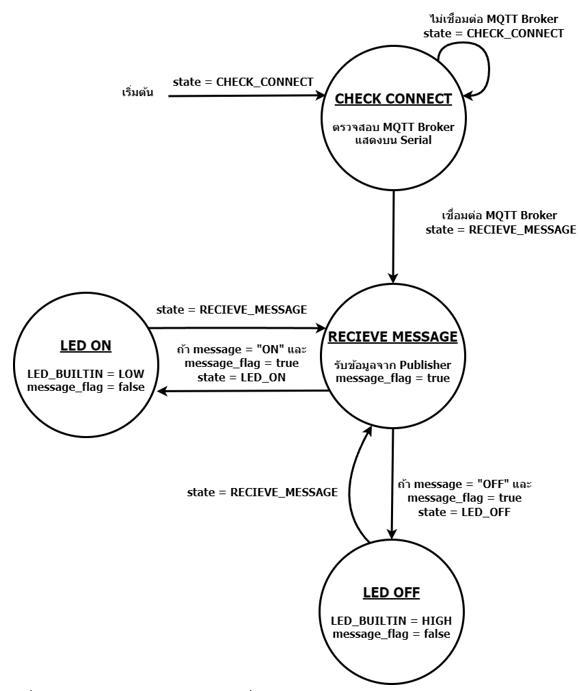
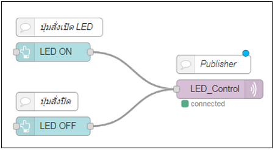
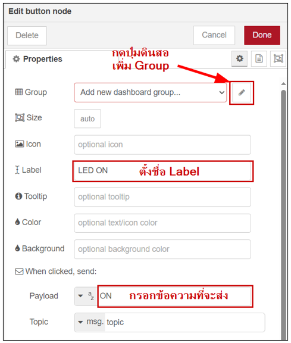
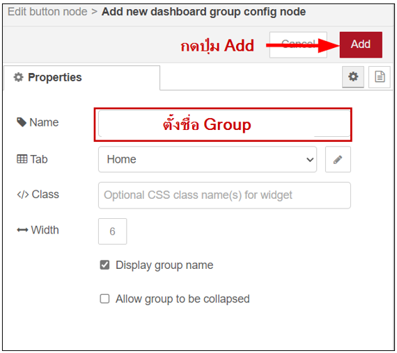
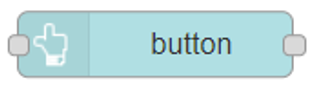
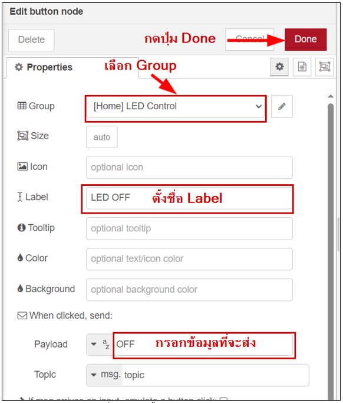
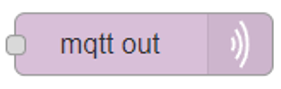
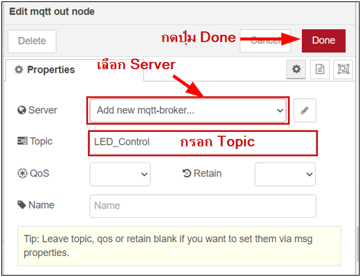
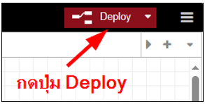
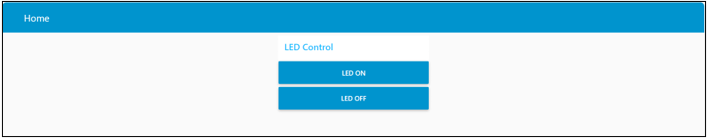

# บทที่ 9 เปิดปิดอุปกรณ์ผ่านเว็บ ตั้งเงื่อนไขในการเปิดปิดได้

No. |ชื่อเรื่อง|
----- |----- |
1)|[Node ต่างๆ สำหรับควบคุมอุปกรณ์บน Node red dashboard](https://github.com/phisic1714/IoT-Learning-Set/blob/main/%E0%B8%9A%E0%B8%97%E0%B8%97%E0%B8%B5%E0%B9%889/%E0%B8%9A%E0%B8%97%E0%B8%97%E0%B8%B5%E0%B9%88_9.md#node-%E0%B8%95%E0%B9%88%E0%B8%B2%E0%B8%87%E0%B9%86-%E0%B8%AA%E0%B8%B3%E0%B8%AB%E0%B8%A3%E0%B8%B1%E0%B8%9A%E0%B8%84%E0%B8%A7%E0%B8%9A%E0%B8%84%E0%B8%B8%E0%B8%A1%E0%B8%AD%E0%B8%B8%E0%B8%9B%E0%B8%81%E0%B8%A3%E0%B8%93%E0%B9%8C%E0%B8%9A%E0%B8%99-node-red-dashboard)|


---
**บทนี้ทำการเชื่อมโยงระหว่าง Node-RED และ NodeMCU ESP8266 สื่อสารผ่าน MQTT** ทำให้เราสามารถควบคุมอุปกรณ์ต่างๆ ผ่านหน้าเว็บไซต์ โดยใช้ โมดูล Node-RED Dashboard ในการควบคุมบนเว็บไซต์

#### **Node ต่างๆ สำหรับควบคุมอุปกรณ์บน Node red dashboard**
•	**button** แสดงปุ่มกดบนหน้าเว็ป สามารถกำหนดข้อมูลที่จะส่งเมื่อมีการกดปุ่ม 1 ครั้ง

•	**dropdown** แสดงกล่องรายกายข้อมูลที่เลือกบนหน้าเว็ป สามารถกำหนดรายการข้อมูลที่จะส่งได้หลายๆข้อมูลในกล่องเดียว

•	**switch** แสดงสวิตซ์บนหน้าเว็ป สามารถกำหนดข้อมูลที่จะส่งทั้งตอนปิดสวิตซ์ และเปิดสวิตซ์

•	**slider** แสดงสไลเดอร์บนหน้าเว็ป สามารถกำหนดช่วงของข้อมูลที่จะส่ง และสามารถกำหนดการส่งข้อมูลเมื่อลากสไลเดอร์ หรือเมื่อลากแล้วปล่อยสไลเดอร์

•	**numeric** แสดงการปรับผ่านหน้าเว็ป มีปุ่มกดเพิ่ม-ลดตัวเลขที่จะส่งโดยสามารถกำหนดช่วงตัวเลขที่จะส่ง

**<details><summary>CLICK : <ins>ตัวอย่างที่ 9.1 สั่งปิดเปิด LED Built-in ผ่าน Node-RED Dashboard</ins></summary>**
<p>

```ruby
#include <ESP8266WiFi.h>
#include <PubSubClient.h>
#define WIFI_STA_NAME "xxxx"    // ชื่อ wifi
#define WIFI_STA_PASS "xxxx"      // รหัส wifi
#define MQTT_SERVER "xxxx" // Server Domain Name หรือ IP Address
#define MQTT_PORT 1883                // Port MQTT Broker
#define MQTT_USERNAME "xxxx"
#define MQTT_PASSWORD "xxxx"
#define MQTT_NAME "xxxx"          // ชื่อที่ต้องการให้แสดงใน MQTT Broker
#define MQTT_TOPIC "LED_Control " // ชื่อ Topic
WiFiClient client;
PubSubClient MQTT(client);
const int CHECK_CONNECT = 0;
const int RECIEVE_MESSAGE = 1;
const int LED_ON = 2;
const int LED_OFF = 3;
bool message_flag;
String message;
int state;
void callback(char *topic, byte *payload, unsigned int length) // ฟังก์ชันสำหรับรับข้อมูลจาก MQTT Broker
{
    message = "";
    message_flag = true; // กำหนดค่า message_flag เป็น true เพื่อบอกให้รู้ว่ามีข้อมูลใหม่เข้ามา
    Serial.print("Message arrived [");
    Serial.print(topic);
    Serial.print("] : ");
    for (int i = 0; i < length; i++)
    {
        message += (char)payload[i]; // เก็บข้อมูลที่ได้รับไว้ในตัวแปร message
    }
}
void setup()
{
    state = CHECK_CONNECT;
    Serial.begin(115200);
    pinMode(LED_BUILTIN, OUTPUT); // กำหนด pin LED_BUILTIN เป็น OUTPUT
    WiFi.mode(WIFI_STA);
    Serial.println(WIFI_STA_NAME);
    Serial.println("WIFI Connecting");
    WiFi.begin(WIFI_STA_NAME, WIFI_STA_PASS); // เชื่อมต่อ wifi
    for (int i = 0; i < 20; i++)
    {
        delay(500);
        Serial.print(".");
    }
    if (WiFi.status() == WL_CONNECTED)
    {
        Serial.print("\nWiFi Connected. \n");
    }
    else
    {
        Serial.print("\nWIFI Connect fail. ");
    }
    MQTT.setServer(MQTT_SERVER, MQTT_PORT);                // กำหนด MQTT Server และ Port
    MQTT.connect(MQTT_NAME, MQTT_USERNAME, MQTT_PASSWORD); // ทำการเชื่อมต่อ MQTT Broker
    MQTT.setCallback(callback);                            // กำหนดฟังก์ชัน callback เป็นฟังก์ชันรับข้อมูลจาก MQTT Broker
    MQTT.subscribe(MQTT_TOPIC);
}
void loop()
{
    switch (state)
    {
    case CHECK_CONNECT:
        // หากไม่ได้เชื่อมต่อ MQTT Broker ให้ทำการเชื่อมต่อใหม่
        if (MQTT.connected())
        {
            Serial.println("MQTT Connected.");
            state = RECIEVE_MESSAGE;
        }
        else
        {
            Serial.println("MQTT Fail Connected.");
        }
        break;
    case RECIEVE_MESSAGE:
        MQTT.loop();
        if (message == "ON" && message_flag == true)
        {
            state = LED_ON;
        }
        else if (message == "OFF" && message_flag == true)
        {
            state = LED_OFF;
        }
        break;
    case LED_ON:
        Serial.println(message);
        digitalWrite(LED_BUILTIN, LOW);
         message_flag = false;
        state = RECIEVE_MESSAGE;
        break;
    case LED_OFF:
        Serial.println(message);
        digitalWrite(LED_BUILTIN, HIGH);
         message_flag = false;
        state = RECIEVE_MESSAGE;
        break;
    }
}
```
<p>
</details>

* **จากตัวอย่างโค้ด 9.1** เชื่อมต่ออินเทอร์เน็ตในรูปแบบไวฟาย, เชื่อมต่อ MQTT โดยใช้ Topic ชื่อ “LED_Control”  และทำการ subscribe topic     จะเริ่มการทำงานที่สถานะ CHECK_CONNECT เพื่อตรวจสอบการเชื่อมต่อ MQTT ถ้าไม่ผ่านจะอยู่ในสถนะเดิม แต่ถ้าผ่านจะทำในสถานะถัดไปคือ RECIEVE_MESSAGE จะเข้าไปทำงานใน Callback โดยคำสั่ง MQTT.loop() เพื่อรับข้อความจาก Publisher มาเก็บในตัวแปร message และตัวแปร message_flag จะเป็นตัวยืนยันว่าเข้ามาทำงานใน Callback แล้ว โดยในสถนะจะมีเงื่อนไขว่าหากได้ข้อความ “ON” จะสั่งให้ ไปสถาน่ะ LED_ON จะสั่งให้ LED_BUILTIN สว่าง หากได้ข้อความ “OFF” จะสั่งให้ ไปสถาน่ะ LED_OFF จะสั่งให้ LED_BUILTIN ดับ แล้วทั้ง 2 สถานะนี้จะวันกลับมาที่สถานะ RECIEVE_MESSAGE



* State Diagram กำหนดคำสั่งเปิด-ปิด LED Built-in ด้วย Node-RED Dashboard กำหนด start เริ่มต้นคือ CHECK_CONNECT โดยภายในสถานะนี้จะตรวจสอบการเชื่อมต่อ MQTT Broker หากไม่เชื่อมต่อจะอยู่แค่สถานะนี้ หากเชื่อมต่อ state จะถูกเปลี่ยนเป็น RECEIVE_MESSAGE โดยภายในสถานะนี้จะรับข้อมูลจากฝั่ง Publisher และจะมี meassage_flag จะยืนยันว่ารับข้อความแล้ว โดยมีเงื่อนไขว่าถ้าข้อความเป็น “OFF” และ meassage_flag= true สถานะจะถูกเปลี่ยนเป็น LED_OFF และกลับมาสถานะ RECEIVE_MESSAGE แต่ถ้าข้อความเป็น “ON” และ meassage_flag= true สถานะจะถูกเปลี่ยน LED_ON จากนั้นทำงานซ้ำตามเงื่อนไขที่เรากำหนด



* จากรูปจะเห็น Flow มีการใช้ Node ของ Dashboard ชื่อ *button* สำหรับเป็นปุ่มบนหน้าเว็ปเพื่อสั่งเปิด-ปิด LED โดยจะส่งผ่าน Node ชื่อ *mqtt out* ที่จะส่งข้อความจากการกดปุ่มไปยัง MQTT Broker โดย**วิธีสร้าง Flow** มีขั้นตอนดังนี้ 

1.	เลือก **Node** ชื่อ *button* ของ **Dashboard** เป็นปุ่มที่จะสั่ง [*LED ON*]


2.	กดเข้าไปใน **Node** ตั้งค่าดังรูปที่ โดยตั้งชื่อ **Label** ในที่นี้คือ [*LED ON*] แล้วกรอกข้อความที่จะส่งในที่นี้คือ “**ON**” และกดปุ่มดินสอเพื่อ**เพิ่ม Group**



3.	เข้ามาแล้ว**ตั้งชื่อ Group** และกดปุ่ม **Add**



4.	 เลือก **Node** ชื่อ *button* ของ **Dashboard** เป็นปุ่มที่จะสั่ง *LED OFF*



5.	กดเข้าไปใน **Node** ตั้งค่าดังรูปที่ โดยตั้งชื่อ **Label** ในที่นี้คือ *LED OFF* แล้วกรอกข้อความที่จะส่งในที่นี้คือ “**OFF**” แล้วเลือก *Group* ที่ตั้งไว้ในข้อที่ 3 และกดปุ่ม *Done*



6.	เลือก **Node** ชื่อ *mqtt out* มาวางบน Flow เพื่อเป็น Publisher ส่งข้อความไปยัง MQTT Broker



7.	กดเข้าไปใน Node ตั้งค่าดังรูปที่ 6.8 โดยกรอก Topic ที่จะตั้งในที่นี้คือ LED_Control จากนั้นตรง Server กดปุ่มรูปดินสอ เพื่อเพิ่ม Broker Server



8.	เชื่อมต่อแต่ละ Node เข้าด้วยกันตามรูปที่ 9.2
9.	กดปุ่ม **Deploy** มุมขวาบน เพื่อเริ่มการทำงานของ Flow



10.	เปิดเว็ปดู Dashboard ดัง URL นี้ http://localhost:1880/ui/
จากในเว็ป Dashboard จะแสดงปุ่ม 2 ปุ่มคือ *LED ON* และ *LED OFF* เมื่อกดปุ่มก็จะส่งข้อความผ่าน MQTT ไปยัง บอร์ดทดลอง ทำให้ LED ติดกับตามการกดแต่ล่ะปุ่มที่ส่งข้อความไป



### คำถามท้ายบทที่ 9
1.	การควบคุมอุปกรณ์ผ่านเว็ปโดยใช้ Node-RED จะใช้อะไรโมดูลอะไร
2.	Node ชื่อ dropdown คืออะไร 
3.	Node ชื่อ numeric คืออะไร
4.	Node ชื่อ slider มีความสามารถอย่างไร
5.	Node ชื่อ button กับ switch ต่างกันอย่างไร
6.	ในบทนี้ใช้ โปรโตคอล อะไรในการสื่อสารระหว่างตัว Board ทดลอง กับ หน้าเว็บ
7.	จากตัวอย่างที่ 9.1 กำหนดใช้ Topic อะไร 
8.	หากต้องการควบคุมเปิด-ปิด LED หลายแต่ล่ะตัวควบคุมแยกกันควรใช้ Node ใด
9.	หากต้องการหลี่แสงไฟ LED ผ่านหน้าเว็บควรใช้ Node ใด
10.	หากต้องการเพิ่ม-ลดความเร็วของ Motor และ ทิศทางการหมุนควรใช้ Node ใด

### ใบงาน 4 ตอน (แบบฝึก)
1)	กำหนดเพิ่มลดความสว่าง LED ผ่าน Dashboard ของ NodeRED
2)	ควบคุมทิศทางไฟ LED โดย Side Node ของ NodeRED
3)	กำหนดสวิตซ์ควบคุมการทำงานไฟ LED 4 ตัว ผ่าน NodeRED
4)	กำหนดทิศทางการหมุนและความเร็วของมอเตอร์ผ่าน NodeRED

ผลลัพธ์ใบงาน https://bit.ly/3tgGo1M 